<div align="center">
  
  <h1>SelfPotify</h1>
</div>

## Objetivos

Mi idea para mi proyecto de fin de grado es crear un "clon" alternativo de código abierto de Spotify. Funcionará con tecnologías de streaming, permitiendo escuchar la música con baja latencia sin tener que esperar a que descargue ningún archivo igual que en el original, y tendrá una pequeña recreación de los sistemas de recomendaciones para que el usuario pueda descubrir música y organizarla a su manera en playlists.

El proyecto incluiría:

- **Backend Self-Potify** — Sirve la API a los clientes. Contiene toda la librería musical organizada en carpetas, además de la BBDD que almacenará tanto los usuarios como sus likes / playlists.
- **Cliente web** — Para escuchar la música del servidor en streaming desde un ordenador. Esto será a través de un servidor web en el que puedes acceder solamente con tu login de usuario.
- **Cliente móvil / televisión** — Aplicación para Android con las mismas funciones que la web pero mayor rendimiento. Al entrar por primera vez, se tendrá que configurar para poner los datos de conexión al servidor (IP / puerto) y el login, que permanecerá activo. El traspaso de datos será mediante una API con JWT, que mantendrá la sesión activa por varios meses.

## Justificación de la necesidad

Este software permitiría a los usuarios administradores levantar una app para sí mismos y sus amigos (creandoles usuarios a parte) poder disfrutar de escuchar música libremente, sin anuncios y gestionándolo todo desde su servidor, necesidad cada vez más creciente debido al abuso de estas empresas de streaming hacia sus consumidores cada vez dando servicios de menos calidad solo para intentar recaudar más dinero.

## Tecnologías a emplear

| Tecnología             | Uso                                                                          |
|------------------------|------------------------------------------------------------------------------|
| **Spring Boot (REST)** | API, lógica back-end y servidor web                                          |
| **FFMPEG**             | Procesado de audio en fragmentos para streaming                              |
| **React + Next JS**    | Front-end del cliente web y recepción de streaming                           |
| **MariaDB**            | Base de datos principal por su fiabilidad y experiencia con ella.            |
| **Jetpack Compose**    | Aplicación móvil y televisión (Android)                                      |
| **Media3**             | Recepción de streaming en la app móvil                                       |
| **Docker Compose**     | Despliegue de la aplicación en contenedores                                  |
| **Nginx**              | Proxy interno para enrutar los servidores Next y Spring cuando se usa docker |


### Uso de Claude Code

Muchas de las líneas de código de este proyecto se han escrito usando Claude Code. Esto ha permitido centrarse más en la experiencia de los usuarios finales y en las features de la app. Para poder seguir un desarrollo
sostenible en la app sin perderse y dejar de entender su funcionamiento, se han seguido prácticas como documentar todas
las features y decisiones en este readme, crear feature branches con commits muy descriptivos, etc.

El flujo de trabajo normalmente fue:

1. **Detectar necesidad**: Pienso una feature que me gustaría agregar, abro la app y encuentro algún bug... 
2. **Crear un plan**: Teniendo una feature o un fix pendiente, explico lo más detallada y técnica posible a la herramienta qué es lo que quiero cambiar o arreglar. La herramienta me propone una solución al problema en forma de archivo markdown, la cual leo entera y voy moldeando y corrigiendo. 
3. **Lanzo el plan**: Claude se ocupa de ejecutarlo y de modificar automáticamente los archivos escribiendo o cambiando el código. 
4. **Revisión**: Me encargo de asegurarme de que todo lo que ha escrito claude funciona correctamente sin romper nada y tal y como lo había planeado.
5. **Documentación**: Escribo en el README.md las decisiones de desarrollo y diseño que he tomado y porqué lo he hecho, para guardar constancia de ello.

#### Skills

A la hora de trabajar con claude, una de las características que más he utilizado son las skills.

Son colecciones de archivos de texto que le dan contexto a la inteligencia artifical para poder seguir por ejemplo buenas prácticas en un lenguaje de programación o framework. El desarrollo del proyecto se ha apoyado sobre todo en las skills next-js-best-practices, para todo la creación del front end, y otra llamada java-springboot, que fue usada para trabajar en el backend.

#### Archivo Claude.md

En el proyecto, sin versionar, se almacenó un archivo llamado CLAUDE.md. Este archivo son las directrices que claude va a seguir cuando lo ejecuto en el mismo directorio donde se encuentra el archivo markdown. En este caso, ha sido de gran ayuda ya que así no hay que todo el rato estar dándole las convecciones del proyecto, arquitectura, etc.

Algunas de las directrices a destacar han sido:

- Si un cambio colisiona con las decisiones del readme, preguntar para saber si adaptarse al readme o cambiarlo.
- Actualizar automáticamente los diagramas al cambiar cosas que los afecten.


---

## Decisiones de diseño

### Arquitectura
He decidido crear esta aplicación basada en **microservicios** en vez de usar una arquitectura monolítica. Esto porque pienso que 
así puedo desarrollar una aplicación más escalable, cuyo core sea el servidor API de springboot, del que consumen diferentes clientes
como el web o mobile, dándome la posibilidad a futuro de crear más para otras plataformas.

Estos microservicios están todos alojados en este **monorepo**, con solamente ejecutar `docker-compose up` se pone la aplicación a funcionar.

### Despliegue e instalación

Como se comentó antes, Selfpotify es un monorepo y ofrece la posibilidad de **desplegarlo con docker**, precisando especificar una ruta con la música para que se monte como volumen (con posibilidad de reescanearlo para no reiniciar el contenedor cada vez que se quiere añadir música). También es posible **hacer un despliegue bare metal**, ideal para trabajar por ejemplo con unidades externas permitiendo gestionar varias carpetas de source para la biblioteca musical.

**Este proyecto está pensado para usuarios técnicos** que quieren reemplazar Spotify por una tecnología similar, accesible y sobre todo más económica y libre, por lo que será su responsabilidad montar y mantener el servidor, así como la mía facilitar lo máximo posible la instalación, configuración y set-up de la estructura de red para permitir el acceso desde internet.

Por esto, en el **primer arranque** el servidor entra en **modo setup** y la web sirve un **wizard de configuración inicial al que se accede sin login**: mientras la instalación no esté completada, cualquier acceso al cliente web redirige siempre a este wizard. En él, el administrador deja el servidor operativo de una pasada — **branding** (nombre, **colores del tema** y logo de la app), **biblioteca musical** (directorios a escanear e intervalo de escaneo) y **usuarios** (cuentas iniciales). El wizard funciona sin autenticación porque, en modo setup, el backend reabre temporalmente los endpoints que necesita (`POST /api/config/setup`, `PUT /api/config`, `POST /api/config/logo`, `POST /api/users`); el control real lo ejerce un guard dinámico (`@setupGuard.inSetupMode()`) ligado al flag `features.setupComplete`.


El estado del wizard se persiste en un fichero YAML externo gestionado por `ConfigService`, con el flag `features.setupComplete` como interruptor entre "primer arranque" y "servidor ya operativo". Al confirmar el wizard, `POST /api/config/setup` marca `setupComplete=true`: el wizard queda **inaccesible** (el cliente deja de redirigir a él) y esos endpoints vuelven a exigir rol `ADMIN`. El endpoint `POST /api/config/reset` permite al admin devolver el servidor al mismo estado en que arrancaría tras un primer despliegue: vacía la BBDD y la config, y reproduce los bootstraps de arranque — reseedea el admin desde `ADMIN_USERNAME`/`ADMIN_PASSWORD` del `.env` (si no están definidos no se crea ningún usuario) y reañade la librería musical del `.env` a `scan.paths` (si está configurada y accesible). Tras el reset, el wizard se vuelve a forzar en el siguiente acceso.

**Decisión de diseño: el selector de colores no deja elegir combinaciones inaccesibles.** Tanto en el wizard como en los ajustes del panel (`ThemeSettings`), el branding de color se controla con **dos semillas** —primario (acento) y secundario (fondo)— de las que se **deriva la paleta completa de 14 colores** en el espacio HCT de Material (`lib/palette.ts`, `derivePalette`), calculando los textos por **contraste WCAG real** (AAA/AA) contra el fondo. Encima hay una galería de **presets accesibles** (semillas curadas) para arrancar de un tema válido con un clic. El color del texto sobre botones (`--color-on-accent`) y el del acento usado como texto/icono sobre el fondo (`--color-accent-text`) **no se almacenan**: se recalculan siempre al aplicar, de modo que sigan al acento/fondo aunque se editen a mano. El **modo avanzado** permite editar los 14 colores uno a uno, pero pasa por una **red de seguridad** (`enforceContrast`) que, tanto en el preview como al pintar la app real, empuja cualquier color de texto ilegible al tono legible más cercano conservando su matiz. Así, ninguna combinación —ni siquiera una editada a mano o heredada de una config antigua— puede dejar textos o iconos invisibles.

Además del wizard, se pueden tocar otras configuraciones que no están ahí (normalmente porque son más técnicas) en el envfile (ver sección "Variables clave del .env").

#### Flujo de setup inicial y reset

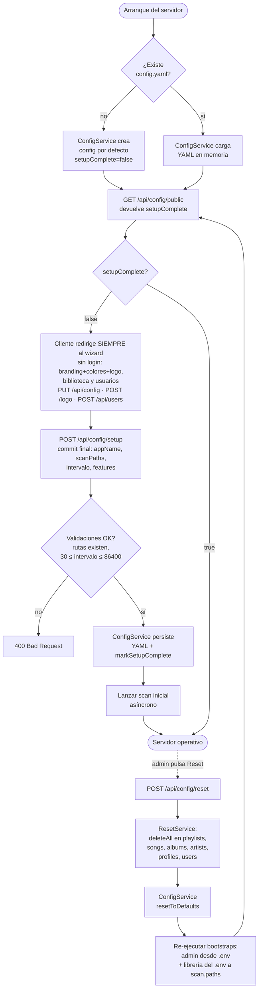

#### Empaquetado y arranque con Docker

Para facilitar al máximo el set-up al usuario técnico, el servidor se empaqueta como una pila de **tres contenedores** orquestada con `docker compose`, manteniendo la filosofía de microservicios y permitiendo escalar o reiniciar cada pieza por separado:

- **`api`** — Spring Boot (`Dockerfile.api`, build multi-stage con Maven → JRE Alpine). Escucha en `:8080`, expuesto al host para los clientes Android/TV. Persiste `config.yml`, logo y assets en el volumen Docker `selfpotify-data` montado en `/data/selfpotify`.
- **`next`** — Frontend Next.js (`front/Dockerfile`, build con `output: "standalone"`). Escucha en `:3000` **solo en la red interna del compose**; nunca se publica al host.
- **`web`** — Nginx (`docker/web/`) escuchando en `:80` (único puerto público del front). Sirve los estáticos `_next/static/`, hace `proxy_pass` a `next:3000` para SSR y a `api:8080` para `/api/*` y `/assets/*`. Con esto, el navegador habla siempre con un único host (`:80`) y se evita CORS y la exposición pública directa del backend a través del front.

Los clientes web pasan por Nginx (`:80`); los clientes Android/TV consumen la API directamente (`:8080`).

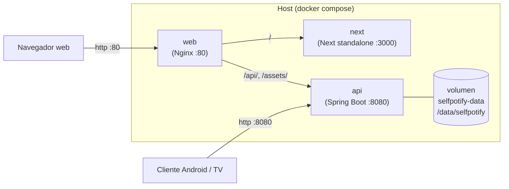

##### Variables clave del `.env`

Toda la configuración por instalación se declara en `.env` (ver `.env.example`). En modo Docker conviene revisar especialmente:

| Variable | Valor recomendado en Docker | Para qué sirve |
|---|---|---|
| `SERVER_PORT` | `8080` | Puerto interno de la API (no cambiar salvo conflicto). |
| `WEB_ORIGIN` | `http://localhost` (o el host público) | CORS del backend. Sin puerto porque el navegador entra por Nginx en `:80`. |
| `JWT_SECRET` | cadena aleatoria ≥32 chars | Firma de JWT; obligatorio cambiarlo del valor del ejemplo. |
| `ADMIN_USERNAME` / `ADMIN_PASSWORD` | credenciales iniciales | Admin auto-bootstrap en el primer arranque si la BBDD está vacía. |
| `DB_URL` | `jdbc:h2:file:/data/selfpotify/db/selfpotify;AUTO_SERVER=TRUE` | Para persistir la BBDD entre reinicios del contenedor (con `DB_DDL_AUTO=update`). El valor por defecto (H2 in-memory) pierde los datos al reiniciar. |
| `APP_CONFIG_PATH` | **no sobreescribir** | Lo fija el contenedor a `/data/selfpotify/config.yml`, que vive en el volumen `selfpotify-data` y sobrevive a reinicios. |
| `H2_CONSOLE_ENABLED` | `false` | Deshabilitar la consola H2 en despliegue. |


### Funcionamiento del streaming

Para hacer que los clientes puedan recibir la música en pedazos de bytes con la librería media3, he implementado la ruta de la API
``/api/listen/{id}``, endpoint que soporta http range, permitiendo reproducir sin descargar el archivo completo.

### Gestión de la biblioteca musical

La biblioteca musical será gestionada por los admins, que tendrán la posibilidad de añadir carpetas que el backend escaneará periódicamente en busca de cambios o nuevas canciones, para poder administrar la música de forma sencilla con el explorer.

El escaneo lo dispara `SchedulingConfig` mediante un `PeriodicTrigger` que **relee el intervalo configurado en cada tick**, de forma que los cambios en `scan.intervalSeconds` realizados vía `PUT /api/config` se aplican en caliente sin reiniciar el servidor. La concurrencia se protege con un `ReentrantLock` en `ScanService`: si llega un tick (o un `POST /api/config/scan/run` manual) mientras hay otro escaneo activo, se descarta. Al añadir una ruta nueva vía `POST /api/config/scan-paths` se lanza además un escaneo inicial asíncrono solo de esa carpeta para no esperar al siguiente tick.

#### Subida de audios desde el panel (drag & drop)

Además de registrar carpetas del servidor, el panel admin permite **subir audios sueltos** (`POST /api/songs/upload`, gestionado por `SongUploadService`). La decisión de diseño clave es **dónde** se escriben: el volumen de música se monta **read-only** en Docker (`/music:ro`), así que los audios subidos no pueden ir ahí. Se guardan en una carpeta `selfpotify_added` **escribible**:

- **En Docker**, dentro del volumen de datos persistente (`/data/selfpotify/selfpotify_added`), el mismo que ya guarda `config.yml` y los assets. El panel no deja elegir ruta porque solo ese volumen es escribible.
- **En local**, dentro de la ruta de música que elija el admin de entre las ya configuradas (`<ruta>/selfpotify_added`) o, por defecto, la carpeta de datos (`~/.selfpotify/selfpotify_added`).

La subida ocurre en **dos fases** (`SongUploadService`) para que el admin revise y ajuste los metadatos **antes** de incorporar la canción, pero pasando por las mismas APIs externas que cualquier otra importación:

- **Staging** (`POST /api/songs/upload`): el audio se guarda en una carpeta temporal `selfpotify_staging/<token>` que **no** está en las rutas de escaneo (para que el escaneo periódico no la importe a medias). Se extraen los metadatos ID3 y, antes de devolver el borrador editable (`SongDraftDTO`), se **enriquece con las mismas fuentes externas que el escaneo** para que el admin vea los datos ya completos en la pantalla de edición previa: **nombre canónico del artista** (Last.fm), **género** si falta (Last.fm) y **carátula** si el audio no traía embebida (Cover Art Archive → iTunes → Deezer).
- **Commit** (`POST /api/songs/commit`): con los metadatos ya ajustados, el audio se mueve a la carpeta `selfpotify_added` **escribible** y se persiste la canción. El artista se resuelve **por MBID** (Last.fm), igual que en el escaneo; tras guardar se rellenan de forma **idempotente** el género/carátula que aún falten y la **foto del artista** (Deezer), que no se ve en la pantalla de edición.

La carpeta `selfpotify_added` **no** se registra como ruta de escaneo: el commit ya persiste cada canción con su `songPath` definitivo y el barrido de disponibilidad del escaneo la mantiene mientras el fichero exista. Así una canción subida es indistinguible de una escaneada del disco. La resolución de identidad del artista (limpieza del nombre, consulta a Last.fm y emparejamiento por MBID) es lógica compartida en `ArtistResolver`, usada tanto por el escaneo como por el commit.

#### Flujo del escaneo periódico


#### Resolución de identidad de artistas

El artista de cada canción se deduce del tag ID3 `ARTIST` (o del nombre de archivo), un valor que escribe quien etiquetó el MP3 y que es inconsistente entre archivos del mismo artista: emojis, espacios sobrantes, mayúsculas, alias o abreviaciones. Emparejar por comparación exacta del nombre hacía que el mismo artista real acabara en varias filas `Artist` distintas (caso observado: `El Alfa`, `✅EL ALFA EL JEFE` y `Alfa` como tres artistas separados; `Mala  fe` y `Mala Fe` como dos).

La decisión es **no fiarse del string del tag y resolver cada artista contra una fuente de verdad externa**. Se descartaron la normalización pura del nombre (no resuelve alias ni abreviaciones), la tabla de alias manual (requiere mantenimiento) y el *fuzzy matching* (riesgo de fusionar artistas reales distintos). Se eligió Last.fm porque el proyecto ya lo integra para clasificar géneros, así que no añade ni dependencias ni variables de entorno nuevas.

Durante el escaneo, `SongService.resolveArtist` limpia el nombre de adornos, lo consulta en Last.fm (`artist.getInfo` con `autocorrect=1`) y obtiene el **nombre canónico** y el **MBID** (MusicBrainz ID, identificador estable). El emparejamiento pasa a hacerse por MBID —no por nombre—, persistido en la columna `Artist.mbid`. Si una fila ya existía sin MBID, se le rellena. Si Last.fm no está configurado o no reconoce al artista, se cae al emparejamiento por nombre limpio, que ya unifica los casos triviales (espacios, mayúsculas). Una caché por lote evita repetir llamadas HTTP dentro del mismo escaneo.

Esta estrategia previene **nuevos** duplicados; los ya existentes en BD requieren una limpieza puntual (o un futuro endpoint de merge para admin).


### Conteo de escuchas derivado de la base de datos

Para crear el feed del usuario con sus recomendaciones, he decidido basarme en las escuchas del usuario para canciones, géneros y artistas en mi algoritmo.

No existe ningún contador numérico de escuchas en las entidades. Los campos
`Song.listeners`, `Album.listeners` y `Artist.listeners` se eliminaron: toda la
popularidad (de canciones, álbumes, artistas **y** géneros) se **deriva por
consulta** a partir de la tabla de eventos `user_song_listen`, la misma fuente
que ya alimentaba las recomendaciones por usuario.

**Decisión de diseño: derivar en vez de duplicar tablas de evento.** Una
escucha de canción ya implica una escucha de su álbum, de cada uno de sus
artistas y de su género. En lugar de mantener contadores incrementales
(propensos a desincronizarse) o tablas de evento separadas por entidad
(redundantes, porque toda la información está en el evento de canción), se
cuenta sobre `user_song_listen` con consultas JPA agrupadas:

| Conteo | Consulta (en `UserSongListenRepository`) |
|---|---|
| Por canción | `countBySong_Id` / `countListensGroupedBySong` (mapa id→escuchas) |
| Por álbum | `countByAlbumId` (`where e.song.album.id = :albumId`) |
| Por artista | `countByArtistId` (`join e.song s join s.artists a`) |
| Por género | `countByGenre` (`where e.song.genre = :genre`) |
| Top artistas global | `findArtistsByGlobalListensDesc` (`group by a order by count(e) desc`) |
| Top canciones de un género/artista | `findSongsByGenreOrderByGlobalListensDesc` / `findSongsByArtistOrderByGlobalListensDesc` |

Ventajas: no hay que mantener nada al hacer streaming (basta registrar el
evento), no hay riesgo de contadores desincronizados, el límite FIFO de 1000
escuchas por usuario acota el coste de las consultas, y el mismo modelo sirve
para popularidad global y para historial por usuario. El precio es contar en
lectura; para los listados (`GET /api/songs`) se usa una única consulta
agrupada (`countListensGroupedBySong`) y un mapa id→escuchas, evitando el N+1.

#### Registro de escuchas por usuario

La tabla cruzada `user_song_listen` (entidad `UserSongListen`, con `@ManyToOne`
a `User` y a `Song`) registra, fila a fila, qué usuario escuchó qué canción y
cuándo. Es la **única fuente** de los conteos.

El registro se dispara en `StreamingController` junto al `registerGenreListen`,
llamando a `UserSongListenService.recordListen(userId, songId)`. Al hacer
streaming **ya no se incrementa ningún contador numérico** (esos métodos y sus
`@Query`/`@Modifying` desaparecieron): el único efecto sobre el conteo es
insertar la fila del evento. La decisión es **registrar la escucha una sola vez
por reproducción**, en la **petición inicial** de `/api/listen/{id}` (la que no
trae cabecera `Range`, o la que pide un rango desde el byte 0). Las peticiones
de rango posteriores —que el reproductor genera al hacer *seek* dentro de la
canción— **no** insertan filas: así un *seek* no infla los conteos ni bloquea el
streaming con escrituras síncronas a la base de datos antes de enviar los bytes.

Para que la tabla no crezca sin control, se acota a **1000 registros por
usuario** con descarte **FIFO**: tras insertar, `recordListen` cuenta las filas
del usuario y, si superan 1000, borra las más antiguas hasta volver al límite
(constante `MAX_ESCUCHAS`, fija en el servicio igual que `MAX_GENEROS` en
`UserFeed` — es un límite de diseño, no configuración por instalación). 1000
escuchas recientes son suficientes para alimentar las recomendaciones y evitan
que el histórico se dispare con muchos usuarios o reproducciones largas. La FK
`song_id` obliga además a vaciar esta tabla antes de borrar canciones, tanto en
el borrado individual (`SongService.delete`) como en el reset
(`ResetService.resetAll`).

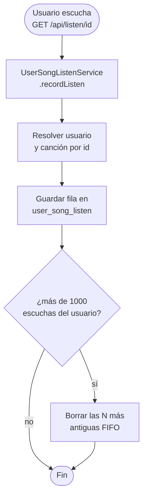

### Feed de recomendaciones del home

Cada usuario tiene asociado obligatoriamente un `UserFeed` (relación `@OneToOne` con `cascade = ALL` y `orphanRemoval`, garantizada por un `@PrePersist` que lo crea si falta). El feed almacena la lista de artistas recomendados que el usuario ve al abrir el home.

El endpoint `GET /api/feed` regenera el feed **en cada acceso al home** con
recomendaciones **personalizadas por usuario** (`UserFeedService.regenerateFeedForUser`
→ `recommendArtistsForUser`). 

El feed devuelve:

1. **Cold-start.** Si *el servidor* no tiene ninguna escucha registrada, o si
   *este* usuario no tiene escuchas propias, no hay historial con el que
   personalizar y se devuelven **todos** los artistas del catálogo.
2. **Descubrimientos diarios**: explicado más abajo.
2. **Por géneros recientes.** Con historial, los 7 huecos personalizados se
   llenan primero con los artistas **más escuchados globalmente dentro de los
   géneros que el usuario ha escuchado últimamente** (la pila reciente
   `last20GenresListened`, cabeza = más reciente, vía
   `findArtistsByGenreOrderByGlobalListensDesc`).
3. **Relleno afín del catálogo.** Si aún quedan huecos, se amplían con más
   artistas de esos mismos géneros según el catálogo (`findArtistsByGenre`),
   aunque todavía no tengan escuchas, para no reducir el feed al único artista ya
   escuchado.
4. **Relleno por popularidad global.** Si todavía faltan, se completan con la
   popularidad global (`findArtistsByGlobalListensDesc`).
5. **3 aleatorios + relleno final.** Se añaden siempre 3 artistas aleatorios del
   catálogo (sin repetir) y, si con todo no se llega a 10 (catálogo pequeño), se
   rellena de nuevo con popularidad global hasta donde se pueda.

La lista resultante (máx. 10, sin repetidos) sobrescribe los artistas
recomendados del feed. La pila de géneros escuchados (`last20GenresListened`) es
historial del usuario y **no** se vacía al regenerar.

#### Flujo de regeneración del feed


#### Carátulas y fotos automáticas

Durante el escaneo, el servidor completa de forma solo si falta la carátula de cada canción y álbum y la foto de cada artista, gemelo de cómo `GenreApiService` rellena el género. El orden de prioridad es:

1. **Carátula embebida** en el propio archivo `.mp3`/`.wav` (etiqueta ID3/APIC). Si existe, se vuelca a `<assets>/covers/<sha256>.<ext>` y se guarda la ruta `/assets/covers/…` (servida por el mismo handler `/assets/**` que el logo); **no se consulta internet** para esa canción. Sirve también como portada del álbum, al ser la del propio lanzamiento.
2. **Fuentes online sin API key** (links a CDN en la nube), "lo más oficial primero": **Cover Art Archive** vía MusicBrainz (portada canónica del *release*) → **iTunes Search API** (CDN de Apple) → **Deezer**. La foto del artista sale de **Deezer** (`picture_xl`), ya que iTunes no la expone y MusicBrainz no aloja fotografías.
3. Si no se encuentra nada (o el link externo muere), el campo queda **`null`** y el frontend pinta su icono/inicial; no se generan placeholders en el backend.

Para poder rellenar `Album.picture_url`, el escaneo ahora **resuelve o crea el álbum** a partir de la etiqueta `ALBUM` del fichero. Todas las fuentes funcionan sin registrar ninguna clave; MusicBrainz solo exige un `User-Agent` descriptivo (`COVER_ART_USER_AGENT`). La resolución online puede desactivarse con `COVER_ART_ENABLED=false` (la extracción de carátula embebida se mantiene).

### Carátulas de playlist

Las playlists pueden tener una imagen de portada cuadrada que solo el creador puede subir o cambiar, tanto al crear la playlist como al editarla más tarde.

**Subida por endpoint separado (`POST /api/playlists/{id}/cover`).** El payload JSON de crear/editar playlist (`PlaylistInput`) no incluye la imagen: el campo `pictureUrl` solo está en el DTO de lectura (`PlaylistDTO`). La carátula viaja como `multipart/form-data` por su propio endpoint. Esto evita convertir todos los endpoints de playlist a multipart y mantiene la API limpia; el único efecto observable es que en la creación el frontend hace dos peticiones consecutivas (crear → subir carátula si la hay). Si la segunda falla, la playlist queda sin carátula, estado válido y recuperable editando.

**Recorte al cuadrado en el servidor con `ImageIO`.** Si la imagen subida no es cuadrada, el backend la recorta por el centro a `min(w, h) × min(h, w)` usando `ImageIO` del JDK, sin dependencias extra. La imagen resultante se guarda siempre como JPEG. El frontend muestra un preview con `object-fit: cover` en un contenedor cuadrado, que refleja visualmente el recorte que aplicará el servidor — el usuario ve el resultado final antes de confirmar.

Alternativa descartada: recorte en el cliente con Canvas antes de subir. Añade complejidad al frontend (exportar Blob, gestionar URLs efímeras de `URL.createObjectURL`) sin ninguna ventaja real, ya que el servidor garantiza el resultado correcto independientemente del cliente.

**Almacenamiento en `assets/playlist-covers/`, mismo patrón que las carátulas de canciones.** El archivo se nombra con el SHA-256 del original — igual que hace `EmbeddedCoverExtractor` — lo que hace la operación idempotente (subir la misma imagen dos veces no crea duplicados). Se sirve mediante el handler estático `/assets/**` ya configurado en `WebMvcConfig`, sin ningún cambio de infraestructura.

### Playlists compartidas (colaboración vía magic link)

Una playlist deja de ser estrictamente individual: su creador puede **invitar a otros usuarios a colaborar** generando un *magic link* de un solo uso. Quien canjea el enlace queda añadido como **colaborador** y, a partir de ahí, propietario y colaboradores comparten la edición del contenido, pero **no** la del continente.

**Reparto de permisos: el continente es del dueño, el contenido es compartido.** Propietario y colaboradores pueden **añadir y quitar canciones** (`POST`/`DELETE /api/playlists/{id}/songs/{songId}`). En cambio, solo el **propietario** puede editar los metadatos de la playlist —nombre, descripción, visibilidad y carátula (`PUT /api/playlists/{id}`, `POST /api/playlists/{id}/cover`)— y **borrarla** (`DELETE /api/playlists/{id}`, que además puede hacer un admin). Un colaborador con acceso a una playlist privada puede verla (`GET /api/playlists/{id}`) aunque no sea pública.

**Decisión de diseño: tabla cruzada explícita (`PlaylistCollaborator`) en lugar de `@ManyToMany` en `Playlist`.** Igual que con `UserFollow`, modelar el vínculo como entidad propia con `playlist`, `user` y `createdAt` (unique key `(playlist_id, user_id)`) evita hidratar la lista entera de colaboradores al leer una playlist, deja hueco para metadatos (cuándo se unió) y permite un borrado controlado: al eliminar una playlist se limpian sus colaboradores y tokens antes de borrar la fila para no chocar con la FK (`PlaylistSharingService.deleteSharingData`). La relación `Playlist ↔ Song` se mantiene como `@ManyToMany` porque ahí no se necesita ningún metadato por arista.

**Decisión de diseño: magic link de un solo uso, sin caducidad temporal.** El token (`PlaylistShareToken`) es un valor aleatorio no adivinable generado con `SecureRandom` (32 bytes, Base64 URL-safe). El "un solo uso" se garantiza **eliminando la fila al canjearla**, no con una flag `used`: una vez consumido, el mismo enlace responde `404`. No se añade caducidad por tiempo (no hay variable de configuración nueva); mientras el token no se canjee, sigue siendo válido. El creador puede generar varios enlaces para una misma playlist (uno por persona a invitar).

**Decisión de diseño: el que canjea se resuelve del `SecurityContext`, nunca del path.** `POST /api/playlists/share/{token}` solo lleva el token; el colaborador a añadir es siempre el usuario autenticado. Canjear un enlace de **tu propia** playlist responde `409 Conflict` (ya eres el dueño). El canje es idempotente respecto al colaborador (si ya lo eras no se duplica la fila), pero el token siempre se consume.

#### Flujo de compartir y canjear


### Descubrimientos diarios

Junto al feed de artistas, el home ofrece una sección de **descubrimientos
diarios**: el endpoint `GET /api/feed/daily-discoveries` devuelve **9 canciones**
(`SongDTO`) pensadas para que el cliente las muestre en un deslizable horizontal.
La lista se compone de tres bloques de tres canciones cada uno
(`DailyDiscoveryService`):

1. **3 aleatorias** del catálogo disponible.
2. **3 no escuchadas** del **último género** que el usuario ha estado escuchando
   (la cabeza de su pila `last20GenresListened`). Si ese género no tiene
   suficientes canciones nuevas, se recorre la pila hacia atrás (al siguiente
   género más reciente) hasta reunir tres.
3. **3 de un género que el usuario no escucha**: un género presente en el
   catálogo pero ausente de su historial de escuchas, elegido al azar entre los
   candidatos. Si el usuario ya escucha todos los géneros disponibles, se cae al
   **género más antiguo de su pila** (último elemento de `last20GenresListened`).

**Decisión de diseño: estable por día, sin persistencia.** Aunque el bloque 1 es
"aleatorio", la sección se llama *diaria* porque toda la aleatoriedad (el muestreo
de cada bloque, la elección del género desconocido y el barajado final) usa un
único generador sembrado con `userId + fecha`, y las consultas devuelven IDs
ordenados por id como base determinista. Así, todas las llamadas del mismo usuario
durante el mismo día devuelven **exactamente la misma lista**, que cambia a
medianoche (estilo "Daily Mix"). No se introduce ninguna entidad ni columna nueva:
el resultado se **recalcula** en cada petición de forma determinista, igual que el
feed de artistas se regenera en cada acceso. Las 9 canciones se devuelven
**mezcladas**, de modo que los tres bloques no se distinguen en el orden final. Si
el catálogo es demasiado pequeño para llenar los tres bloques sin repetir, se
completa con canciones aleatorias hasta llegar a 9 (o menos, si no hay más).

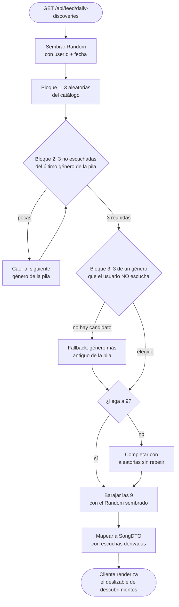

### Búsqueda global

Un único endpoint, `GET /api/search`, cubre canciones, artistas, álbumes,
playlists, usuarios y géneros con la misma forma de respuesta. Es el cimiento
de cualquier barra de búsqueda que monten los clientes.

**Decisión de diseño: un solo endpoint, dos modos.** En lugar de exponer una
ruta por entidad (`/api/songs/search`, `/api/artists/search`…) el backend
ofrece un único endpoint con un parámetro `type`. En modo `all` (default)
devuelve hasta 5 elementos por categoría, pensado para una vista previa
multi-categoría. En modo específico (`type=songs|artists|albums|playlists|users|genres`)
devuelve solo esa categoría paginada (`page`/`size`). La forma de la respuesta
es la misma en ambos casos (`SearchResponseDTO` con un slice por categoría);
las categorías no usadas se omiten del JSON.

**Decisión de diseño: normalización en aplicación, no en SQL.** Para que la
búsqueda sea insensible a mayúsculas, acentos y signos diacríticos —
`"rosalia"` debe encontrar `"Rosalía"` y viceversa — tanto la consulta como el
texto buscable se pasan por la misma rutina: `Normalizer.Form.NFD` + strip de
`\p{InCombiningDiacriticalMarks}+` + `toLowerCase(Locale.ROOT)` + colapso de
espacios. Esto se hace en Java, no en SQL, porque H2 (desarrollo) y MariaDB
(producción) no comparten sintaxis para desdiacritizar y mantener una única
rutina compartida garantiza que la query y los haystacks acaben exactamente en
la misma forma canónica. La query normalizada se tokeniza por espacios y se
exige que **todos** los tokens estén presentes en el haystack (estilo barra de
YouTube/Spotify: `"stairway heaven"` empareja con `"Stairway to Heaven"`
aunque `"to"` no esté en la consulta).

**Decisión de diseño: filtrado en memoria, no índice invertido.** El servicio
carga la lista completa de cada repositorio (`findAll`) y filtra en memoria.
Es una elección consciente para esta versión: selfpotify está pensado como
servidor personal con catálogos acotados, así que cargar las pocas miles de
filas que cualquier instalación realista va a tener cuesta menos que mantener
un índice o atarse a particularidades del motor SQL. El contrato del endpoint
no expone esta decisión, así que se puede sustituir por Lucene/PostgreSQL
full-text en el futuro sin tocar a los clientes si llegado el caso hace falta.
Para evitar el N+1 al exponer el conteo de escuchas de las canciones se
reutiliza la consulta agrupada de `SongService.getListenCountsBySong()` (la
misma que ya usan los listados generales).

**Decisión de diseño: scoring de relevancia simple, predecible.** El orden de
los resultados sigue una jerarquía explícita sobre el campo principal de cada
categoría (título de canción, nombre de artista/álbum/playlist/género,
username): `0` = exacto · `1` = empieza por la consulta · `2` = alguna palabra
empieza por el primer token · `3` = subcadena. Los empates se rompen con una
métrica natural por categoría (escuchas desc para canciones, nº de canciones
desc para artistas/álbumes/playlists/géneros, orden alfabético para usuarios).
No hay tf-idf ni boosting cruzado: el comportamiento debe poder explicarse en
una frase para que un usuario que escribe `"rock"` entienda por qué la canción
titulada exactamente "Rock" aparece antes que "Bohemian Rhapsody (Rock)".

**Decisión de diseño: visibilidad de playlists igual que en el resto de la
app.** La búsqueda nunca devuelve playlists privadas ajenas. Solo aparecen las
**públicas** y las **propias** del usuario autenticado, replicando exactamente
la regla que ya aplican `GET /api/playlists/{id}` y `GET /api/playlists/user/{userId}`,
para que la búsqueda no sea un canal lateral de fuga. Para el resto de
entidades no hay nada que ocultar: canciones, artistas, álbumes, géneros y
usuarios son visibles para cualquier sesión autenticada.

#### Flujo de una búsqueda


### Perfil de usuario (nombre visible + foto)

Además del `username` —identificador único e inmutable usado para el login— cada usuario tiene asociado un `Profile` con un **nombre visible** (`name`, libre y editable) y una **foto de perfil** (`pictureUrl`). Ambos campos son opcionales: si están vacíos, la UI cae al username y a la inicial.

**Decisión de diseño: editar el perfil propio vive bajo `/api/me/*`, no bajo `/api/users/{id}`.** El controlador `UserController` está reservado a operaciones de administrador (alta de cuentas, cambio de rol, borrado); meter ahí los endpoints "editar mi propio nombre" o "subir mi foto" forzaría guards condicionales por id en cada método. El nuevo `ProfileController` separa los dos casos: `GET /api/me`, `PUT /api/me/profile`, `POST /api/me/profile/picture` y `DELETE /api/me/profile/picture` operan **siempre sobre el usuario autenticado** —el id sale del `SecurityContext`, no del path— y `GET /api/users/{id}/public` devuelve la misma `UserSummaryDTO` que ya usa la búsqueda para que cualquier autenticado pueda abrir el perfil de otro. Así no se cruzan permisos: el admin nunca edita el perfil de otro usuario por error y un usuario corriente nunca tiene que pasar por un endpoint admin.

**Decisión de diseño: la pantalla del propio perfil es la misma que ven los demás; la edición vive en una página aparte.** En el cliente hay tres rutas: `/profile` (mi perfil), `/user/[id]` (perfil de otro) y `/profile/edit` (formulario para tocar nombre y foto). `/profile` y `/user/[id]` montan el **mismo componente** `UserProfileView`, que consume `GET /api/users/{id}/public` + `GET /api/playlists/user/{userId}`; lo único que cambia es un icono de lápiz junto al nombre que se pinta cuando el username del perfil coincide con el del auth store. El menú del topbar pasa de "Editar perfil" a "Ver tu perfil" y enlaza a `/profile`. La ventaja: el dueño ve exactamente lo que va a ver el resto de gente —si su nombre o su avatar quedan raros, lo nota sin tener que abrir un perfil ajeno para comparar—. Y separar la edición evita modos en la vista: la pantalla pública nunca contiene inputs, así que pulsar accidentalmente sobre el avatar no abre un selector de archivo cuando no toca.

**Decisión de diseño: subida del avatar por endpoint multipart separado, mismo patrón que la carátula de playlist.** El `PUT /api/me/profile` es un JSON pequeño (`{ "name": "..." }`) y la foto viaja por su propio endpoint multipart, recortándose al cuadrado en el servidor con `ImageIO` y persistiéndose como `assets/avatars/<sha256>.jpg`. Es la misma decisión que ya tomamos para `POST /api/playlists/{id}/cover`: mantenemos la API JSON limpia y reusamos el handler estático `/assets/**` para servir la imagen sin más infraestructura. El nombrado por SHA-256 hace la operación idempotente —subir dos veces la misma imagen no crea duplicados— y permite que `DELETE /api/me/profile/picture` se limite a poner el campo a `null` sin borrar el fichero físico (podría estar referenciado por otra cuenta que subió la misma imagen).

**Decisión de diseño: buscar también por nombre visible sin penalizar el score.** La búsqueda de usuarios (`/api/search?type=users`) ya incluía `Profile.name` en el haystack —los matches "se notaban"— pero el score se calculaba **solo sobre el username**, así que un usuario con `displayName="María López"` y `username="maria_l"` aparecía peor posicionado al buscar "María" que el usuario `username="maria"`. Ahora el score por usuario es `min(score(username), score(displayName))`: el campo que mejor coincide con la consulta es el que cuenta. El tiebreaker sigue siendo alfabético por username, que es único y siempre está presente.

#### Flujo: ver tu perfil y editarlo

```mermaid
flowchart TD
    Menu([Click en avatar del topbar]) --> View[Cliente navega a /profile]
    View --> Me[GET /api/me<br/>(resolver mi id)]
    Me --> Public[GET /api/users/id/public<br/>+ GET /api/playlists/user/userId]
    Public --> Render[Render UserProfileView:<br/>avatar, nombre, badge admin,<br/>playlists públicas]
    Render --> Owner{¿El username del perfil<br/>coincide con el del auth store?}
    Owner -- sí --> Pencil[Pintar icono de lápiz<br/>junto al nombre]
    Owner -- no --> NoPencil[Sin lápiz: vista pública pura]
    Pencil --> Click{¿Click en el lápiz?}
    Click -- no --> End([Fin])
    Click -- sí --> Edit[Navegar a /profile/edit]
    Edit --> Choice{¿Qué cambia?}
    Choice -- Nombre --> Put[PUT /api/me/profile<br/>body: name]
    Put --> Persist[ProfileController:<br/>crear Profile si no existía<br/>cascade ALL y actualizar name]
    Choice -- Foto nueva --> Upload[POST /api/me/profile/picture<br/>multipart: file]
    Upload --> Crop[Recortar al cuadrado<br/>con ImageIO + SHA-256]
    Crop --> Save[Guardar assets/avatars/sha.jpg<br/>+ persistir pictureUrl]
    Choice -- Quitar foto --> Clear[DELETE /api/me/profile/picture]
    Clear --> Null[ProfileController:<br/>pictureUrl = null]
    Persist --> DTO[Devolver UserSummaryDTO]
    Save --> DTO
    Null --> DTO
    DTO --> Invalidate[React Query invalida key 'me'<br/>y la vista pública]
    Invalidate --> View
```

#### Carátulas y fotos automáticas

Durante el escaneo, el servidor completa de forma **idempotente** (solo si falta) la carátula de cada canción y álbum y la foto de cada artista, gemelo de cómo `GenreApiService` rellena el género. El orden de prioridad es:

1. **Carátula embebida** en el propio archivo `.mp3`/`.wav` (etiqueta ID3/APIC). Si existe, se vuelca a `<assets>/covers/<sha256>.<ext>` y se guarda la ruta `/assets/covers/…` (servida por el mismo handler `/assets/**` que el logo); **no se consulta internet** para esa canción. Sirve también como portada del álbum, al ser la del propio lanzamiento.
2. **Fuentes online sin API key** (links a CDN en la nube), "lo más oficial primero": **Cover Art Archive** vía MusicBrainz (portada canónica del *release*) → **iTunes Search API** (CDN de Apple) → **Deezer**. La foto del artista sale de **Deezer** (`picture_xl`), ya que iTunes no la expone y MusicBrainz no aloja fotografías.
3. Si no se encuentra nada (o el link externo muere), el campo queda **`null`** y el frontend pinta su icono/inicial; no se generan placeholders en el backend.

Para poder rellenar `Album.picture_url`, el escaneo ahora **resuelve o crea el álbum** a partir de la etiqueta `ALBUM` del fichero. Todas las fuentes funcionan sin registrar ninguna clave; MusicBrainz solo exige un `User-Agent` descriptivo (`COVER_ART_USER_AGENT`). La resolución online puede desactivarse con `COVER_ART_ENABLED=false` (la extracción de carátula embebida se mantiene).

### Grafo de seguimiento entre usuarios

Cada usuario puede seguir y ser seguido por otros, formando un **grafo dirigido**: la arista `follower → followed` significa que `follower` ve a `followed` en su lista de "siguiendo". `UserSummaryDTO` incorpora dos contadores derivados (`followersCount`, `followingCount`) y una flag `isFollowedByMe` que indica si el usuario en sesión ya sigue al usuario representado por el DTO.

**Decisión de diseño: tabla cruzada explícita (`UserFollow`) en lugar de `@ManyToMany` en `User`.** Modelar las aristas como una entidad propia con `follower`, `followed` y `createdAt` (con unique key `(follower_id, followed_id)`) sigue el mismo patrón que ya usa `UserSongListen` y aporta tres cosas que un `@ManyToMany(User → User)` no daría:

1. **No se hidratan listas al cargar un usuario.** Si los seguidores vivieran como `Set<User>` en la entidad `User`, leer un perfil arrastraría el set por defecto (o forzaría a tocar el fetch en cada caller). Con la tabla cruzada, los counts se piden por consulta agregada (`countByFollowed_Id`, `countByFollower_Id`) y nunca cargan listas.
2. **Aristas con metadatos**. `createdAt` se rellena en `@PrePersist` y permite ordenar la lista de seguidores por "más recientes primero" sin sacarlo del aire en cada llamada; queda hueco para añadir más metadatos (notificaciones, *muted*, etc.) si hace falta.
3. **Borrado simétrico controlado.** Cuando se borra un usuario hay que limpiar las aristas en las que aparece como `follower` <em>o</em> como `followed`. `UserFollowRepository.deleteAllInvolving(userId)` lo hace con un único `DELETE` JPQL, y tanto `UserService.delete` como `ResetService.resetAll` lo invocan antes de borrar el `User` para no chocar con la FK. Con un `@ManyToMany` en `User` el cascade habría sido posible pero menos predecible (Hibernate no garantiza el orden de borrado de las dos direcciones).

**Decisión de diseño: el path del POST/DELETE solo nombra al *followed*, nunca al follower.** El cliente llama a `POST /api/users/{id}/follow` y el servidor sustituye el `follower` por <strong>el usuario autenticado</strong> resuelto desde el `SecurityContext`. Que un cliente nunca pueda firmar la arista con un follower que no sea él mismo evita por construcción el caso "Alice fuerza a Bob a seguir a Carol". `POST` y `DELETE` son <strong>idempotentes</strong>: seguir a quien ya sigues, o dejar de seguir a quien no sigues, responden 200 con el `UserSummaryDTO` actualizado sin error; el cliente no tiene que mantener estado para distinguir "primer click" del segundo.

**Decisión de diseño: counts y `isFollowedByMe` solo se rellenan en los endpoints de perfil; la búsqueda los manda a 0/null.** El DTO lleva los tres campos siempre (contrato JSON estable), pero solo los endpoints de perfil (`/api/me`, `/api/users/{id}/public`, `/api/users/{id}/follow`, `/followers`, `/following`) los calculan. `SearchService` se mantiene a salvo de un N+1 que duplicaría el coste de cada búsqueda sin un beneficio visible (la UI de búsqueda no pinta esos números). Para los listados de followers/following se evita el N+1 con dos consultas agregadas (`countFollowersGrouped`, `countFollowingGrouped`) y una sola query batch que devuelve el subconjunto de ids ya seguidos por el viewer (`findFollowedIdsByFollowerAmong`).

**Decisión de diseño: en el frontend, los botones de seguir/dejar de seguir por fila viven solo en mis propias listas.** Los contadores son enlaces estilo Spotify a `/user/{id}/followers` y `/user/{id}/following`, accesibles desde cualquier perfil. La página de lista compara `me.id` (de `/api/me`) con el `[id]` de la URL: si coincide, las filas incluyen un botón "Siguiendo / Seguir" que llama a `useFollowUser`/`useUnfollowUser`; si no, las filas son puramente navegables (clic = ir al perfil de esa persona). La razón es no convertir la página en un panel de moderación inverso: si ves a quién sigue otro usuario, no eres tú quien decide a quién quitar de su lista, así que el botón solo aparece cuando estás operando sobre tu propio grafo.

#### Flujo de seguir y dejar de seguir

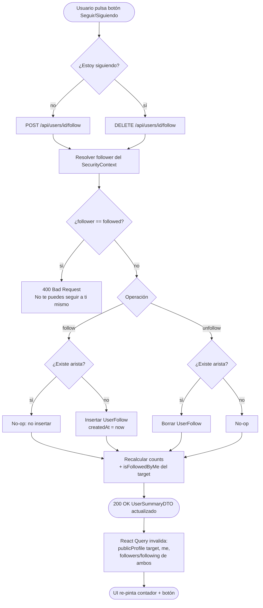

---

## Gestión de recursos

Al ser un aplicativo pensado para un uso personal, normalmente con pocos usuarios, el servidor no requiere de grandes prestaciones hardware. 
Sí serán necesarios unos mínimos para poder emitir correctamente el streaming, como una buena conexión de red (CAT5 mínimo) y 2 GB de RAM. 

La única limitación de recursos en el uso de la aplicación, al estar tratando con archivos multimedia, es el espacio en disco del server para almacenar la música. No hay un mínimo, pero se recomienda tener abundante (200 GB) para poder llegar a disponer 
de un catálogo considerable de música, sobre todo si el usuario se preocupa por la calidad de la misma. 

## Diagrama de clases

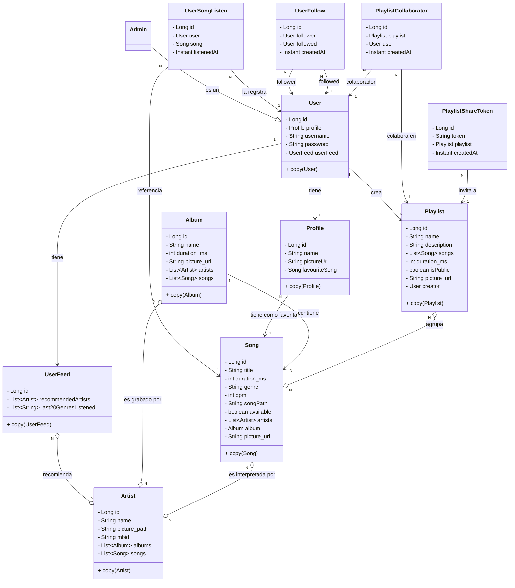

---

## Diagramas de casos de uso

### UC1 — Incorporar música a la biblioteca (carpeta o subida)

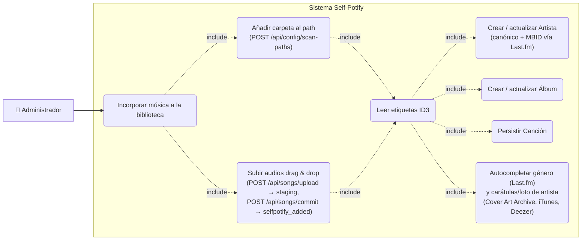

### UC2 — Crear playlist, añadir canciones y compartir

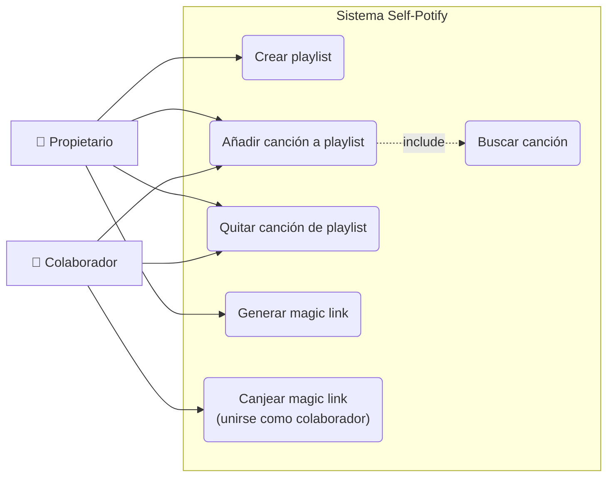

### UC3 — Registro y creación de perfil

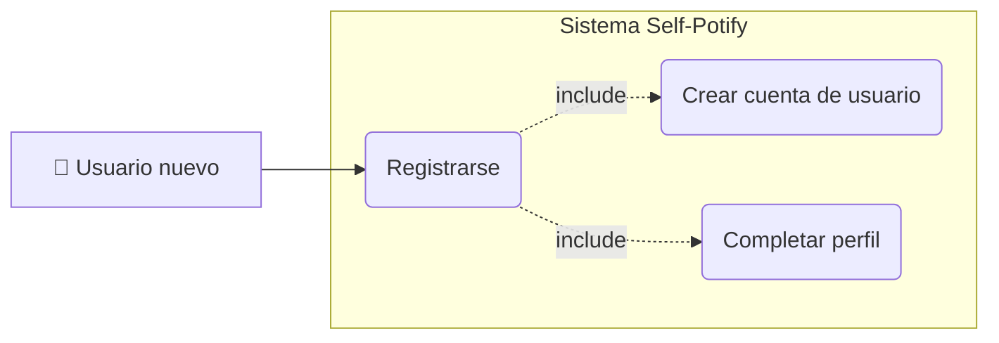

### UC4 — Login

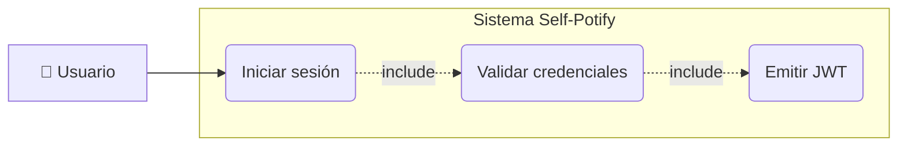

### UC5 — Escuchar una canción

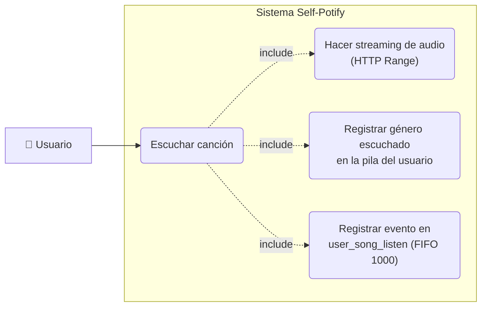

### UC6 — Setup inicial del servidor

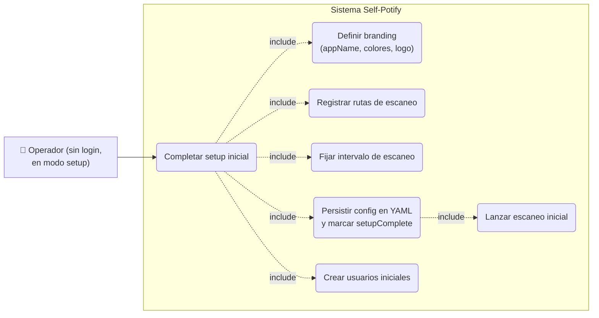

### UC7 — Reset del servidor

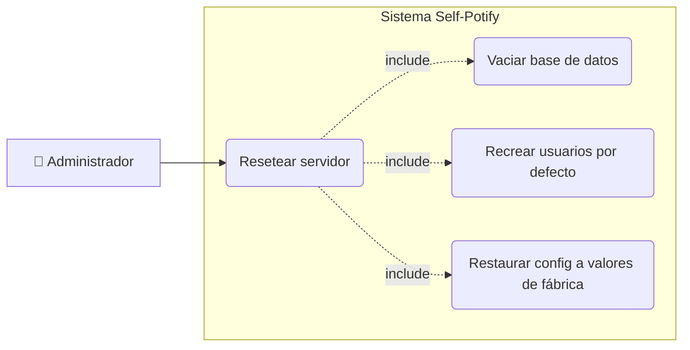

### UC8 — Gestionar branding y logo

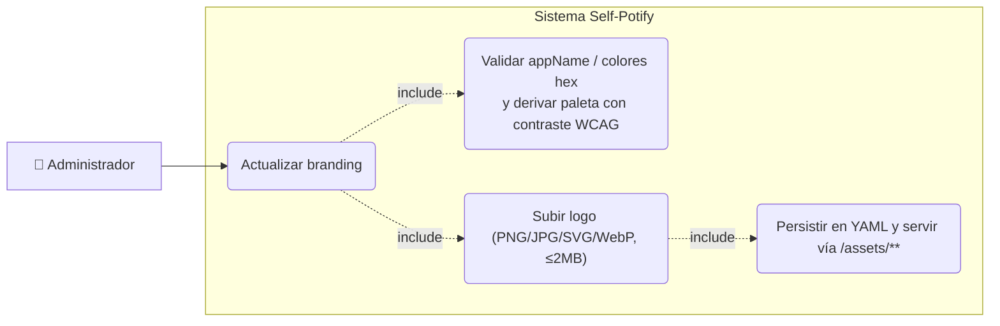

### UC9 — Ver el feed de recomendaciones del home

```mermaid
graph LR
    User["👤 Usuario"]

    subgraph Sistema Self-Potify
        UC9("Abrir el home")
        UC9a("Regenerar feed del usuario")
        UC9b("Recomendar hasta 10 artistas<br/>por géneros recientes + 3 aleatorios<br/>(todos los artistas si no tiene escuchas)")
        UC9c("Mostrar artistas recomendados")
    end

    User --> UC9
    UC9 -.->|include| UC9a
    UC9a -.->|include| UC9b
    UC9 -.->|include| UC9c
```

### UC10 — Ver la página de un artista

```mermaid
graph LR
    User["👤 Usuario"]

    subgraph Sistema Self-Potify
        UC10("Abrir página de artista")
        UC10a("Consultar datos del artista")
        UC10b("Listar top 10 canciones<br/>del artista por oyentes")
    end

    User --> UC10
    UC10 -.->|include| UC10a
    UC10 -.->|include| UC10b
```

### UC11b — Ver tu propio perfil y editarlo

```mermaid
graph LR
    User["👤 Usuario"]

    subgraph Sistema Self-Potify
        UCP("Ver tu perfil (/profile)")
        UCPa("Cargar mi vista pública<br/>(GET /api/me + /api/users/{id}/public)")
        UCPb("Listar mis playlists públicas<br/>(GET /api/playlists/user/{userId})")
        UCE("Editar perfil (/profile/edit)")
        UCEa("Cambiar nombre visible<br/>(PUT /api/me/profile)")
        UCEb("Subir foto<br/>(POST /api/me/profile/picture)")
        UCEc("Quitar foto<br/>(DELETE /api/me/profile/picture)")
    end

    User --> UCP
    UCP -.->|include| UCPa
    UCP -.->|include| UCPb
    UCP -.->|extend| UCE
    UCE -.->|extend| UCEa
    UCE -.->|extend| UCEb
    UCE -.->|extend| UCEc
```

### UC11c — Ver el perfil público de otro usuario

```mermaid
graph LR
    User["👤 Usuario"]

    subgraph Sistema Self-Potify
        UCV("Abrir perfil de otro usuario (/user/[id])")
        UCVa("Buscar usuario<br/>(/api/search?type=users)")
        UCVb("Cargar vista pública<br/>(GET /api/users/{id}/public)")
        UCVc("Listar sus playlists públicas<br/>(GET /api/playlists/user/{userId})")
    end

    User --> UCV
    UCV -.->|include| UCVa
    UCV -.->|include| UCVb
    UCV -.->|include| UCVc
```

### UC11d — Seguir / dejar de seguir a otro usuario

```mermaid
graph LR
    User["👤 Usuario"]

    subgraph Sistema Self-Potify
        UCF("Seguir / dejar de seguir")
        UCFa("Resolver follower<br/>del SecurityContext")
        UCFb("Validar follower ≠ followed")
        UCFc("Crear o borrar arista<br/>UserFollow (idempotente)")
        UCFd("Recalcular counts +<br/>isFollowedByMe del target")
    end

    User --> UCF
    UCF -.->|include| UCFa
    UCF -.->|include| UCFb
    UCF -.->|include| UCFc
    UCF -.->|include| UCFd
```

### UC11e — Ver las listas de seguidores / siguiendo

```mermaid
graph LR
    User["👤 Usuario"]

    subgraph Sistema Self-Potify
        UCL("Abrir /user/[id]/followers o /following")
        UCLa("Obtener lista<br/>(GET /api/users/{id}/followers|following)")
        UCLb("Enriquecer DTOs en batch<br/>(counts + isFollowedByMe)")
        UCLc{"¿La lista es mía<br/>(me.id == [id])?"}
        UCLd("Render filas SIN botón")
        UCLe("Render filas CON botón<br/>Siguiendo / Seguir")
    end

    User --> UCL
    UCL -.->|include| UCLa
    UCLa -.->|include| UCLb
    UCLb --> UCLc
    UCLc -- no --> UCLd
    UCLc -- sí --> UCLe
```

### UC11 — Ver los descubrimientos diarios

```mermaid
graph LR
    User["👤 Usuario"]

    subgraph Sistema Self-Potify
        UC11("Abrir el home")
        UC11a("Calcular descubrimientos diarios<br/>(estables por día)")
        UC11b("Tomar 3 canciones aleatorias")
        UC11c("Tomar 3 no escuchadas<br/>del último género")
        UC11d("Tomar 3 de un género<br/>que no escucha")
        UC11e("Mostrar 9 canciones<br/>mezcladas en el deslizable")
    end

    User --> UC11
    UC11 -.->|include| UC11a
    UC11a -.->|include| UC11b
    UC11a -.->|include| UC11c
    UC11a -.->|include| UC11d
    UC11 -.->|include| UC11e
```

### UC12 — Gestionar el catálogo de canciones

```mermaid
graph LR
    Admin["👤 Administrador"]

    subgraph Sistema Self-Potify
        UC12("Gestionar catálogo de canciones")
        UC12a("Subir audios drag & drop<br/>(POST /api/songs/upload)")
        UC12e("Autocompletar en staging<br/>género/artista/carátula (Last.fm,<br/>Cover Art Archive/iTunes/Deezer)<br/>antes de mostrar la edición previa")
        UC12b("Editar metadatos<br/>(PUT /api/songs/{id}:<br/>title, género, BPM, duración, carátula)")
        UC12c("Eliminar canción<br/>(DELETE /api/songs/{id})")
        UC12d("Conservar songPath<br/>(la edición no toca la ruta física)")
    end

    Admin --> UC12
    UC12 -.->|include| UC12a
    UC12 -.->|include| UC12b
    UC12 -.->|include| UC12c
    UC12a -.->|include| UC12e
    UC12b -.->|include| UC12d
```

### UC13 — Cambiar el rol de un usuario

```mermaid
graph LR
    Admin["👤 Administrador"]

    subgraph Sistema Self-Potify
        UC13("Cambiar rol de usuario")
        UC13a("Reasignar discriminador users.type<br/>(PUT /api/users/{id}/role)")
        UC13b{"¿Es el último ADMIN<br/>y se intenta degradar?"}
        UC13c("Rechazar con 400<br/>(no degradar al último admin)")
        UC13d("Refrescar contexto<br/>y devolver usuario actualizado")
    end

    Admin --> UC13
    UC13 -.->|include| UC13a
    UC13a --> UC13b
    UC13b -- sí --> UC13c
    UC13b -- no --> UC13d
```

## Diagrama de arquitectura


