<div align="center">
  
  <h1>SelfPotify</h1>
</div>

## Objetivos

Mi idea para mi proyecto de fin de grado es crear un "clon" alternativo de código abierto de Spotify. Funcionará con tecnologías de streaming, permitiendo escuchar la música con baja latencia sin tener que esperar a que descargue ningún archivo igual que en el original, y tendrá sistemas de playlist creadas automáticamente como "Recomendaciones Diarias" o "Selección del artista".

El proyecto incluiría:

- **Servidor Self-Potify** — Contiene toda la librería musical organizada en carpetas, además de la BBDD que almacenará tanto los usuarios como sus likes / playlists.
- **Cliente web** — Para escuchar la música del servidor en streaming desde un ordenador. Esto será a través de un servidor web en el que puedes acceder solamente con tu login de usuario.
- **Cliente móvil / televisión** — Aplicación para Android con las mismas funciones que la web pero mayor rendimiento. Al entrar por primera vez, se tendrá que configurar para poner los datos de conexión al servidor (IP / puerto) y el login, que permanecerá activo. El traspaso de datos será mediante una API con JWT, que mantendrá la sesión activa por varios meses.

## Justificación de la necesidad

Este software permitiría a los usuarios poder disfrutar de escuchar música libremente, sin anuncios y gestionándolo todo desde su servidor, necesidad cada vez más creciente debido al abuso de estas empresas de streaming hacia sus consumidores cada vez dando servicios de menos calidad solo para intentar recaudar más dinero.

## Tecnologías a emplear

| Tecnología             | Uso |
|------------------------|---|
| **Spring Boot (REST)** | API, lógica back-end y servidor web |
| **FFMPEG**             | Procesado de audio en fragmentos para streaming |
| **React + Next JS**    | Front-end del cliente web y recepción de streaming |
| **MongoDB**            | Base de datos principal por su flexibilidad con datos dinámicos (playlists, likes…) |
| **Jetpack Compose**    | Aplicación móvil y televisión (Android) |
| **Media3**             | Recepción de streaming en la app móvil |

---

## Decisiones de diseño

### Arquitectura
He decidido crear esta aplicación basada en **microservicios** en vez de usar una arquitectura monolítica. Esto porque pienso que 
así puedo desarrollar una aplicación más escalable, cuyo core sea el servidor API de springboot, del que consumen diferentes clientes
como el web o mobile, dándome la posibilidad a futuro de crear más para otras plataformas.

### Despliegue

**Este proyecto está pensado para usuarios técnicos** que quieren reemplazar Spotify por una tecnología similar, accesible y sobre todo más económica y libre, por lo que será su responsabilidad montar y mantener el servidor, así como la mía facilitar lo máximo posible la instalación, configuración y set-up de la estructura de red para permitir el acceso desde internet.

Por esto, en el **primer arranque** el servidor entra en **modo setup** y la web sirve un **wizard de configuración inicial al que se accede sin login**: mientras la instalación no esté completada, cualquier acceso al cliente web redirige siempre a este wizard. En él, el administrador deja el servidor operativo de una pasada — **branding** (nombre, colores y logo de la app), **biblioteca musical** (directorios a escanear e intervalo de escaneo) y **usuarios** (cuentas iniciales). El wizard funciona sin autenticación porque, en modo setup, el backend reabre temporalmente los endpoints que necesita (`POST /api/config/setup`, `PUT /api/config`, `POST /api/config/logo`, `POST /api/users`); el control real lo ejerce un guard dinámico (`@setupGuard.inSetupMode()`) ligado al flag `features.setupComplete`.

El estado del wizard se persiste en un fichero YAML externo gestionado por `ConfigService`, con el flag `features.setupComplete` como interruptor entre "primer arranque" y "servidor ya operativo". Al confirmar el wizard, `POST /api/config/setup` marca `setupComplete=true`: el wizard queda **inaccesible** (el cliente deja de redirigir a él) y esos endpoints vuelven a exigir rol `ADMIN`. El endpoint `POST /api/config/reset` permite al admin devolver el servidor a su estado de fábrica (vaciado de BBDD, usuarios por defecto `admin/admin` y `user/password`, y config en blanco), volviendo a forzar el wizard en el siguiente acceso.

#### Flujo de setup inicial y reset

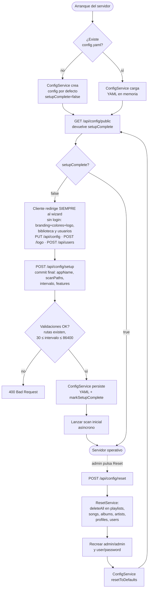

#### Empaquetado y arranque con Docker

Para facilitar al máximo el set-up al usuario técnico, el servidor se empaqueta como una pila de **tres contenedores** orquestada con `docker compose`, manteniendo la filosofía de microservicios y permitiendo escalar o reiniciar cada pieza por separado:

- **`api`** — Spring Boot (`Dockerfile.api`, build multi-stage con Maven → JRE Alpine). Escucha en `:8080`, expuesto al host para los clientes Android/TV. Persiste `config.yml`, logo y assets en el volumen Docker `selfpotify-data` montado en `/data/selfpotify`.
- **`next`** — Frontend Next.js (`front/Dockerfile`, build con `output: "standalone"`). Escucha en `:3000` **solo en la red interna del compose**; nunca se publica al host.
- **`web`** — Nginx (`docker/web/`) escuchando en `:80` (único puerto público del front). Sirve los estáticos `_next/static/`, hace `proxy_pass` a `next:3000` para SSR y a `api:8080` para `/api/*` y `/assets/*`. Con esto, el navegador habla siempre con un único host (`:80`) y se evita CORS y la exposición pública directa del backend a través del front.

Los clientes web pasan por Nginx (`:80`); los clientes Android/TV consumen la API directamente (`:8080`).

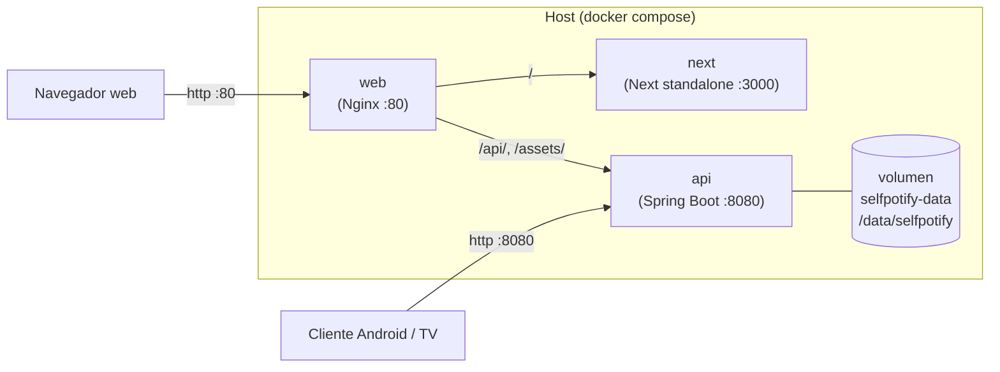

##### Variables clave del `.env`

Toda la configuración por instalación se declara en `.env` (ver `.env.example`). En modo Docker conviene revisar especialmente:

| Variable | Valor recomendado en Docker | Para qué sirve |
|---|---|---|
| `SERVER_PORT` | `8080` | Puerto interno de la API (no cambiar salvo conflicto). |
| `WEB_ORIGIN` | `http://localhost` (o el host público) | CORS del backend. Sin puerto porque el navegador entra por Nginx en `:80`. |
| `JWT_SECRET` | cadena aleatoria ≥32 chars | Firma de JWT; obligatorio cambiarlo del valor del ejemplo. |
| `ADMIN_USERNAME` / `ADMIN_PASSWORD` | credenciales iniciales | Admin auto-bootstrap en el primer arranque si la BBDD está vacía. |
| `DB_URL` | `jdbc:h2:file:/data/selfpotify/db/selfpotify;AUTO_SERVER=TRUE` | Para persistir la BBDD entre reinicios del contenedor (con `DB_DDL_AUTO=update`). El valor por defecto (H2 in-memory) pierde los datos al reiniciar. |
| `APP_CONFIG_PATH` | **no sobreescribir** | Lo fija el contenedor a `/data/selfpotify/config.yml`, que vive en el volumen `selfpotify-data` y sobrevive a reinicios. |
| `H2_CONSOLE_ENABLED` | `false` | Deshabilitar la consola H2 en despliegue. |

##### Arranque

```bash
cp .env.example .env        # ajusta JWT_SECRET, ADMIN_PASSWORD y WEB_ORIGIN
docker compose up -d --build
```

Tras unos segundos, la app está disponible en `http://localhost/` (web) y en `http://<host>:8080/api/...` (clientes móviles).

### Funcionamiento del streaming

Para hacer que los clientes puedan recibir la música en pedazos de bytes con la librería media3, he implementado la ruta de la API
``/api/listen/{id}``, endpoint que soporta http range, permitiendo reproducir sin descargar el archivo completo.

### Gestión de la biblioteca musical

La biblioteca musical será gestionada por los admins, que tendrán la posibilidad de añadir carpetas que el backend escaneará periódicamente en busca de cambios o nuevas canciones, para poder administrar la música de forma sencilla con el explorer.

El escaneo lo dispara `SchedulingConfig` mediante un `PeriodicTrigger` que **relee el intervalo configurado en cada tick**, de forma que los cambios en `scan.intervalSeconds` realizados vía `PUT /api/config` se aplican en caliente sin reiniciar el servidor. La concurrencia se protege con un `ReentrantLock` en `ScanService`: si llega un tick (o un `POST /api/config/scan/run` manual) mientras hay otro escaneo activo, se descarta. Al añadir una ruta nueva vía `POST /api/config/scan-paths` se lanza además un escaneo inicial asíncrono solo de esa carpeta para no esperar al siguiente tick.

#### Flujo del escaneo periódico

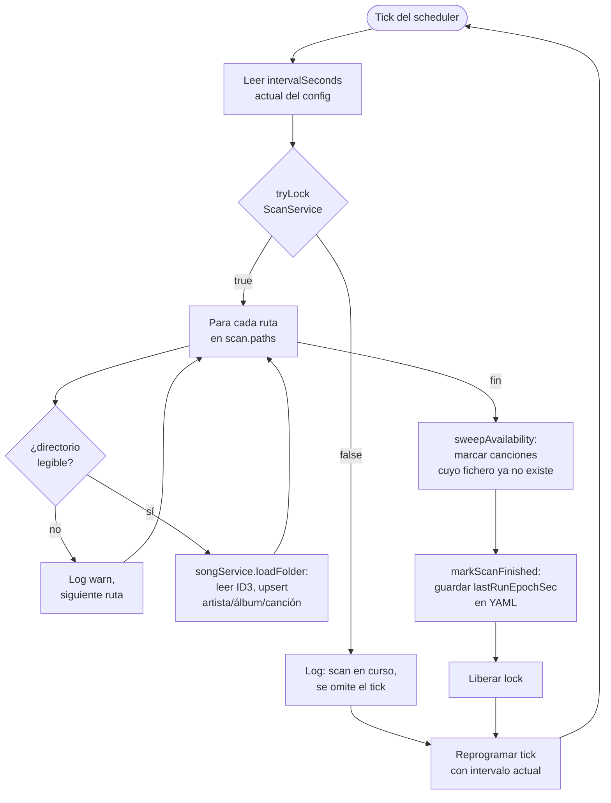

#### Resolución de identidad de artistas

El artista de cada canción se deduce del tag ID3 `ARTIST` (o del nombre de archivo), un valor que escribe quien etiquetó el MP3 y que es inconsistente entre archivos del mismo artista: emojis, espacios sobrantes, mayúsculas, alias o abreviaciones. Emparejar por comparación exacta del nombre hacía que el mismo artista real acabara en varias filas `Artist` distintas (caso observado: `El Alfa`, `✅EL ALFA EL JEFE` y `Alfa` como tres artistas separados; `Mala  fe` y `Mala Fe` como dos).

La decisión es **no fiarse del string del tag y resolver cada artista contra una fuente de verdad externa**. Se descartaron la normalización pura del nombre (no resuelve alias ni abreviaciones), la tabla de alias manual (requiere mantenimiento) y el *fuzzy matching* (riesgo de fusionar artistas reales distintos). Se eligió Last.fm porque el proyecto ya lo integra para clasificar géneros, así que no añade ni dependencias ni variables de entorno nuevas.

Durante el escaneo, `SongService.resolveArtist` limpia el nombre de adornos, lo consulta en Last.fm (`artist.getInfo` con `autocorrect=1`) y obtiene el **nombre canónico** y el **MBID** (MusicBrainz ID, identificador estable). El emparejamiento pasa a hacerse por MBID —no por nombre—, persistido en la columna `Artist.mbid`. Si una fila ya existía sin MBID, se le rellena. Si Last.fm no está configurado o no reconoce al artista, se cae al emparejamiento por nombre limpio, que ya unifica los casos triviales (espacios, mayúsculas). Una caché por lote evita repetir llamadas HTTP dentro del mismo escaneo.

Esta estrategia previene **nuevos** duplicados; los ya existentes en BD requieren una limpieza puntual (o un futuro endpoint de merge para admin).

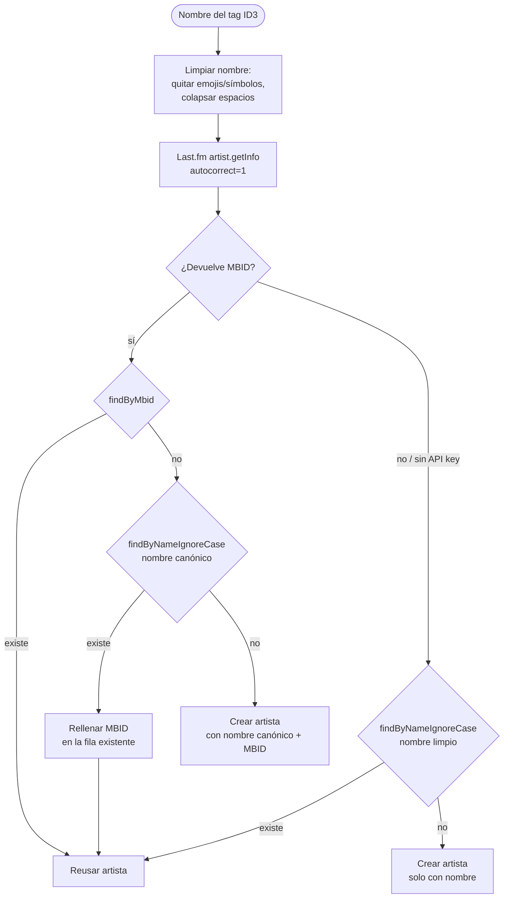

### Conteo de escuchas derivado de la base de datos

No existe ningún contador numérico de escuchas en las entidades. Los campos
`Song.listeners`, `Album.listeners` y `Artist.listeners` se eliminaron: toda la
popularidad (de canciones, álbumes, artistas **y** géneros) se **deriva por
consulta** a partir de la tabla de eventos `user_song_listen`, la misma fuente
que ya alimentaba las recomendaciones por usuario.

**Decisión de diseño: derivar en vez de duplicar tablas de evento.** Una
escucha de canción ya implica una escucha de su álbum, de cada uno de sus
artistas y de su género. En lugar de mantener contadores incrementales
(propensos a desincronizarse) o tablas de evento separadas por entidad
(redundantes, porque toda la información está en el evento de canción), se
cuenta sobre `user_song_listen` con consultas JPA agrupadas:

| Conteo | Consulta (en `UserSongListenRepository`) |
|---|---|
| Por canción | `countBySong_Id` / `countListensGroupedBySong` (mapa id→escuchas) |
| Por álbum | `countByAlbumId` (`where e.song.album.id = :albumId`) |
| Por artista | `countByArtistId` (`join e.song s join s.artists a`) |
| Por género | `countByGenre` (`where e.song.genre = :genre`) |
| Top artistas global | `findArtistsByGlobalListensDesc` (`group by a order by count(e) desc`) |
| Top canciones de un género/artista | `findSongsByGenreOrderByGlobalListensDesc` / `findSongsByArtistOrderByGlobalListensDesc` |

Ventajas: no hay que mantener nada al hacer streaming (basta registrar el
evento), no hay riesgo de contadores desincronizados, el límite FIFO de 1000
escuchas por usuario acota el coste de las consultas, y el mismo modelo sirve
para popularidad global y para historial por usuario. El precio es contar en
lectura; para los listados (`GET /api/songs`) se usa una única consulta
agrupada (`countListensGroupedBySong`) y un mapa id→escuchas, evitando el N+1.

#### Registro de escuchas por usuario

La tabla cruzada `user_song_listen` (entidad `UserSongListen`, con `@ManyToOne`
a `User` y a `Song`) registra, fila a fila, qué usuario escuchó qué canción y
cuándo. Es la **única fuente** de los conteos.

El registro se dispara en `StreamingController` junto al `registerGenreListen`,
llamando a `UserSongListenService.recordListen(userId, songId)`. Al hacer
streaming **ya no se incrementa ningún contador numérico** (esos métodos y sus
`@Query`/`@Modifying` desaparecieron): el único efecto sobre el conteo es
insertar la fila del evento. La decisión es **crear un registro por cada
petición HTTP** de `/api/listen/{id}`: como el reproductor sirve una
reproducción en varias peticiones de rango, una sola escucha real genera varias
filas. Se asume a propósito por simplicidad, y el límite por usuario (ver abajo)
absorbe esa multiplicidad.

Para que la tabla no crezca sin control, se acota a **1000 registros por
usuario** con descarte **FIFO**: tras insertar, `recordListen` cuenta las filas
del usuario y, si superan 1000, borra las más antiguas hasta volver al límite
(constante `MAX_ESCUCHAS`, fija en el servicio igual que `MAX_GENEROS` en
`UserFeed` — es un límite de diseño, no configuración por instalación). 1000
escuchas recientes son suficientes para alimentar las recomendaciones y evitan
que el histórico se dispare con muchos usuarios o reproducciones largas. La FK
`song_id` obliga además a vaciar esta tabla antes de borrar canciones, tanto en
el borrado individual (`SongService.delete`) como en el reset
(`ResetService.resetAll`).


### Feed de recomendaciones del home

Cada usuario tiene asociado obligatoriamente un `UserFeed` (relación `@OneToOne` con `cascade = ALL` y `orphanRemoval`, garantizada por un `@PrePersist` que lo crea si falta). El feed almacena la lista de artistas recomendados que el usuario ve al abrir el home.

El endpoint `GET /api/feed` regenera el feed **en cada acceso al home** con
recomendaciones **personalizadas por usuario** (`UserFeedService.regenerateFeedForUser`
→ `recommendArtistsForUser`). El feed devuelve hasta **10 artistas**
(`FEED_SIZE`), de los que **siempre se reservan 3 aleatorios** del catálogo como
descubrimiento (`RANDOM_ARTISTS`), dejando **7 huecos personalizados**:

1. **Cold-start.** Si *el servidor* no tiene ninguna escucha registrada, o si
   *este* usuario no tiene escuchas propias, no hay historial con el que
   personalizar y se devuelven **todos** los artistas del catálogo.
2. **Por géneros recientes.** Con historial, los 7 huecos personalizados se
   llenan primero con los artistas **más escuchados globalmente dentro de los
   géneros que el usuario ha escuchado últimamente** (la pila reciente
   `last20GenresListened`, cabeza = más reciente, vía
   `findArtistsByGenreOrderByGlobalListensDesc`).
3. **Relleno afín del catálogo.** Si aún quedan huecos, se amplían con más
   artistas de esos mismos géneros según el catálogo (`findArtistsByGenre`),
   aunque todavía no tengan escuchas, para no reducir el feed al único artista ya
   escuchado.
4. **Relleno por popularidad global.** Si todavía faltan, se completan con la
   popularidad global (`findArtistsByGlobalListensDesc`).
5. **3 aleatorios + relleno final.** Se añaden siempre 3 artistas aleatorios del
   catálogo (sin repetir) y, si con todo no se llega a 10 (catálogo pequeño), se
   rellena de nuevo con popularidad global hasta donde se pueda.

La lista resultante (máx. 10, sin repetidos) sobrescribe los artistas
recomendados del feed. La pila de géneros escuchados (`last20GenresListened`) es
historial del usuario y **no** se vacía al regenerar.

#### Flujo de regeneración del feed


#### Carátulas y fotos automáticas

Durante el escaneo, el servidor completa de forma **idempotente** (solo si falta) la carátula de cada canción y álbum y la foto de cada artista, gemelo de cómo `GenreApiService` rellena el género. El orden de prioridad es:

1. **Carátula embebida** en el propio archivo `.mp3`/`.wav` (etiqueta ID3/APIC). Si existe, se vuelca a `<assets>/covers/<sha256>.<ext>` y se guarda la ruta `/assets/covers/…` (servida por el mismo handler `/assets/**` que el logo); **no se consulta internet** para esa canción. Sirve también como portada del álbum, al ser la del propio lanzamiento.
2. **Fuentes online sin API key** (links a CDN en la nube), "lo más oficial primero": **Cover Art Archive** vía MusicBrainz (portada canónica del *release*) → **iTunes Search API** (CDN de Apple) → **Deezer**. La foto del artista sale de **Deezer** (`picture_xl`), ya que iTunes no la expone y MusicBrainz no aloja fotografías.
3. Si no se encuentra nada (o el link externo muere), el campo queda **`null`** y el frontend pinta su icono/inicial; no se generan placeholders en el backend.

Para poder rellenar `Album.picture_url`, el escaneo ahora **resuelve o crea el álbum** a partir de la etiqueta `ALBUM` del fichero. Todas las fuentes funcionan sin registrar ninguna clave; MusicBrainz solo exige un `User-Agent` descriptivo (`COVER_ART_USER_AGENT`). La resolución online puede desactivarse con `COVER_ART_ENABLED=false` (la extracción de carátula embebida se mantiene).

### Carátulas de playlist

Las playlists pueden tener una imagen de portada cuadrada que solo el creador puede subir o cambiar, tanto al crear la playlist como al editarla más tarde.

**Subida por endpoint separado (`POST /api/playlists/{id}/cover`).** El payload JSON de crear/editar playlist (`PlaylistInput`) no incluye la imagen: el campo `pictureUrl` solo está en el DTO de lectura (`PlaylistDTO`). La carátula viaja como `multipart/form-data` por su propio endpoint. Esto evita convertir todos los endpoints de playlist a multipart y mantiene la API limpia; el único efecto observable es que en la creación el frontend hace dos peticiones consecutivas (crear → subir carátula si la hay). Si la segunda falla, la playlist queda sin carátula, estado válido y recuperable editando.

**Recorte al cuadrado en el servidor con `ImageIO`.** Si la imagen subida no es cuadrada, el backend la recorta por el centro a `min(w, h) × min(h, w)` usando `ImageIO` del JDK, sin dependencias extra. La imagen resultante se guarda siempre como JPEG. El frontend muestra un preview con `object-fit: cover` en un contenedor cuadrado, que refleja visualmente el recorte que aplicará el servidor — el usuario ve el resultado final antes de confirmar.

Alternativa descartada: recorte en el cliente con Canvas antes de subir. Añade complejidad al frontend (exportar Blob, gestionar URLs efímeras de `URL.createObjectURL`) sin ninguna ventaja real, ya que el servidor garantiza el resultado correcto independientemente del cliente.

**Almacenamiento en `assets/playlist-covers/`, mismo patrón que las carátulas de canciones.** El archivo se nombra con el SHA-256 del original — igual que hace `EmbeddedCoverExtractor` — lo que hace la operación idempotente (subir la misma imagen dos veces no crea duplicados). Se sirve mediante el handler estático `/assets/**` ya configurado en `WebMvcConfig`, sin ningún cambio de infraestructura.

**Sin migración de base de datos.** El proyecto usa `spring.jpa.hibernate.ddl-auto=update`, por lo que añadir el campo `pictureUrl` a la entidad `Playlist` crea la columna automáticamente al arrancar.

### Descubrimientos diarios

Junto al feed de artistas, el home ofrece una sección de **descubrimientos
diarios**: el endpoint `GET /api/feed/daily-discoveries` devuelve **9 canciones**
(`SongDTO`) pensadas para que el cliente las muestre en un deslizable horizontal.
La lista se compone de tres bloques de tres canciones cada uno
(`DailyDiscoveryService`):

1. **3 aleatorias** del catálogo disponible.
2. **3 no escuchadas** del **último género** que el usuario ha estado escuchando
   (la cabeza de su pila `last20GenresListened`). Si ese género no tiene
   suficientes canciones nuevas, se recorre la pila hacia atrás (al siguiente
   género más reciente) hasta reunir tres.
3. **3 de un género que el usuario no escucha**: un género presente en el
   catálogo pero ausente de su historial de escuchas, elegido al azar entre los
   candidatos. Si el usuario ya escucha todos los géneros disponibles, se cae al
   **género más antiguo de su pila** (último elemento de `last20GenresListened`).

**Decisión de diseño: estable por día, sin persistencia.** Aunque el bloque 1 es
"aleatorio", la sección se llama *diaria* porque toda la aleatoriedad (el muestreo
de cada bloque, la elección del género desconocido y el barajado final) usa un
único generador sembrado con `userId + fecha`, y las consultas devuelven IDs
ordenados por id como base determinista. Así, todas las llamadas del mismo usuario
durante el mismo día devuelven **exactamente la misma lista**, que cambia a
medianoche (estilo "Daily Mix"). No se introduce ninguna entidad ni columna nueva:
el resultado se **recalcula** en cada petición de forma determinista, igual que el
feed de artistas se regenera en cada acceso. Las 9 canciones se devuelven
**mezcladas**, de modo que los tres bloques no se distinguen en el orden final. Si
el catálogo es demasiado pequeño para llenar los tres bloques sin repetir, se
completa con canciones aleatorias hasta llegar a 9 (o menos, si no hay más).


#### Carátulas y fotos automáticas

Durante el escaneo, el servidor completa de forma **idempotente** (solo si falta) la carátula de cada canción y álbum y la foto de cada artista, gemelo de cómo `GenreApiService` rellena el género. El orden de prioridad es:

1. **Carátula embebida** en el propio archivo `.mp3`/`.wav` (etiqueta ID3/APIC). Si existe, se vuelca a `<assets>/covers/<sha256>.<ext>` y se guarda la ruta `/assets/covers/…` (servida por el mismo handler `/assets/**` que el logo); **no se consulta internet** para esa canción. Sirve también como portada del álbum, al ser la del propio lanzamiento.
2. **Fuentes online sin API key** (links a CDN en la nube), "lo más oficial primero": **Cover Art Archive** vía MusicBrainz (portada canónica del *release*) → **iTunes Search API** (CDN de Apple) → **Deezer**. La foto del artista sale de **Deezer** (`picture_xl`), ya que iTunes no la expone y MusicBrainz no aloja fotografías.
3. Si no se encuentra nada (o el link externo muere), el campo queda **`null`** y el frontend pinta su icono/inicial; no se generan placeholders en el backend.

Para poder rellenar `Album.picture_url`, el escaneo ahora **resuelve o crea el álbum** a partir de la etiqueta `ALBUM` del fichero. Todas las fuentes funcionan sin registrar ninguna clave; MusicBrainz solo exige un `User-Agent` descriptivo (`COVER_ART_USER_AGENT`). La resolución online puede desactivarse con `COVER_ART_ENABLED=false` (la extracción de carátula embebida se mantiene).

---

## Gestión de recursos

Al ser un aplicativo pensado para un uso personal, normalmente con pocos usuarios, el servidor no requiere de grandes prestaciones hardware. 
Sí serán necesarios unos mínimos para poder emitir correctamente el streaming, como una buena conexión de red (CAT5 mínimo) y 2 GB de RAM. 

La única limitación de recursos en el uso de la aplicación, al estar tratando con archivos multimedia, es el espacio en disco del server para almacenar la música. No hay un mínimo, pero se recomienda tener abundante (200 GB) para poder llegar a disponer 
de un catálogo considerable de música, sobre todo si el usuario se preocupa por la calidad de la misma. 

## Diagrama de clases

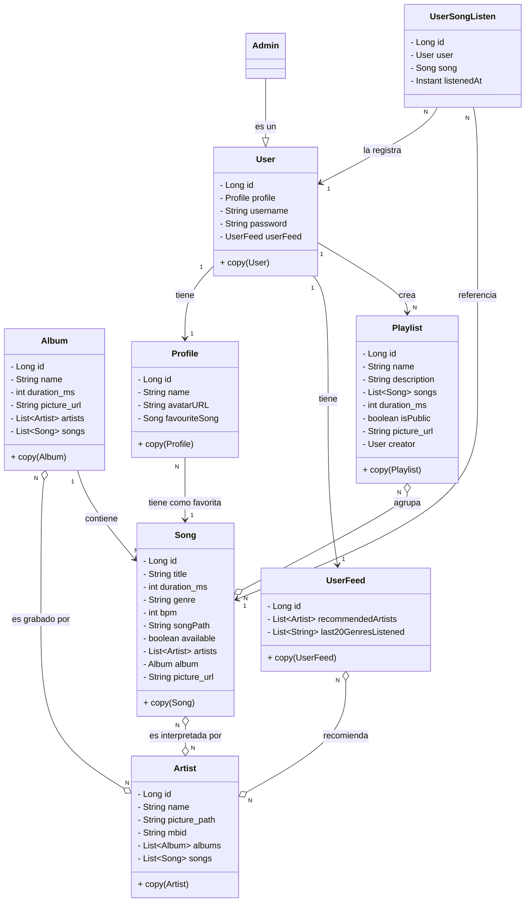

---

## Diagramas de casos de uso

### UC1 — Añadir carpeta al path

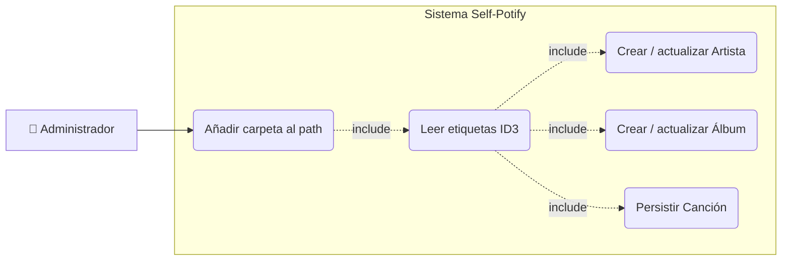

### UC2 — Crear playlist y añadir canciones

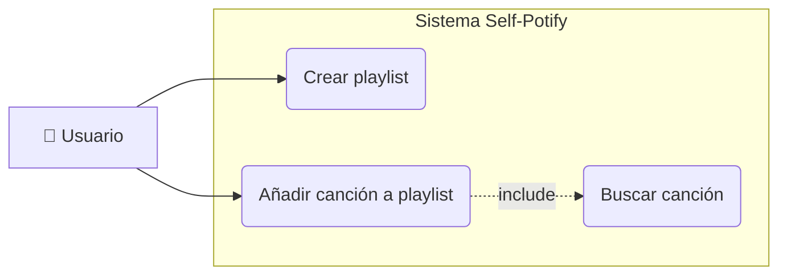

### UC3 — Registro y creación de perfil

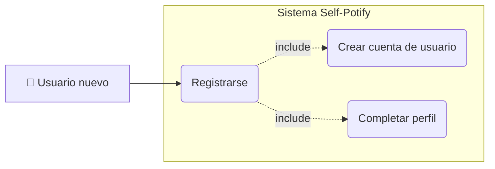

### UC4 — Login

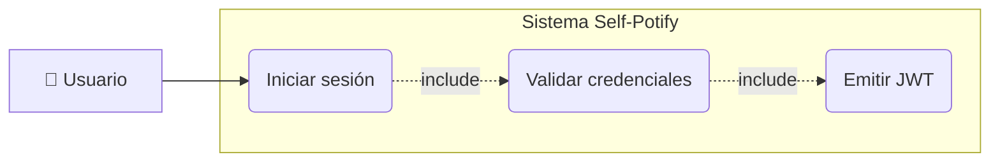

### UC5 — Escuchar una canción

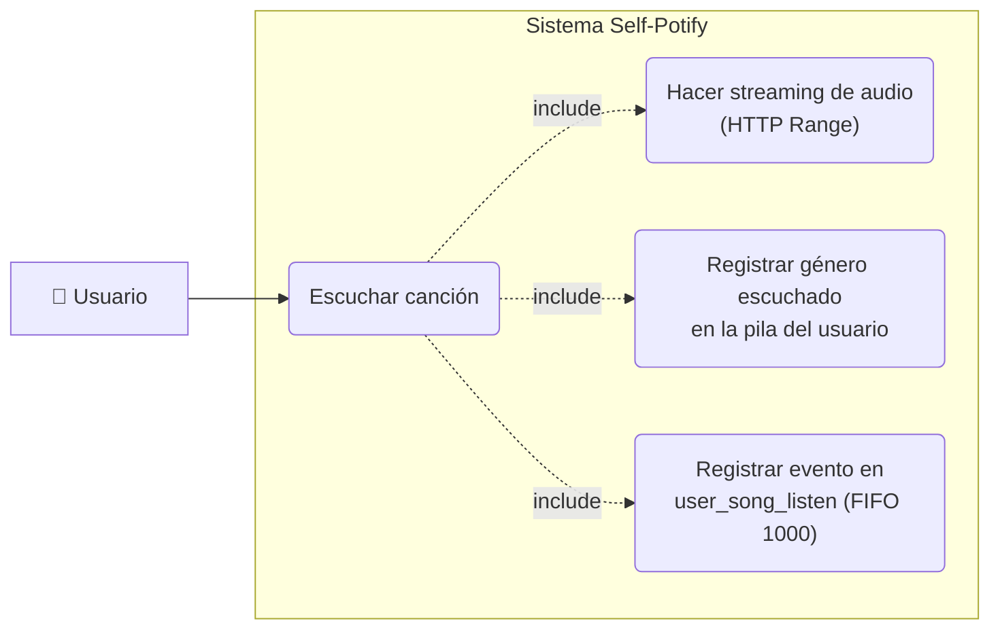

### UC6 — Setup inicial del servidor

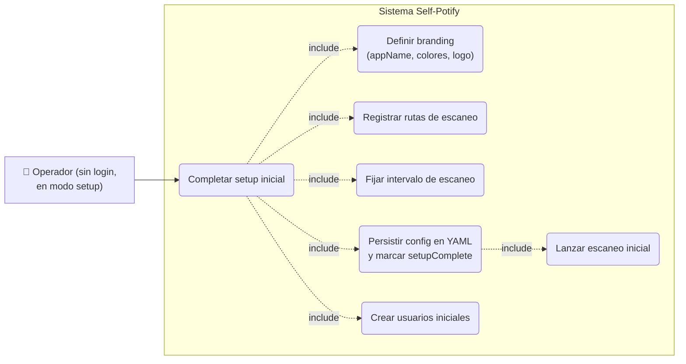

### UC7 — Reset del servidor

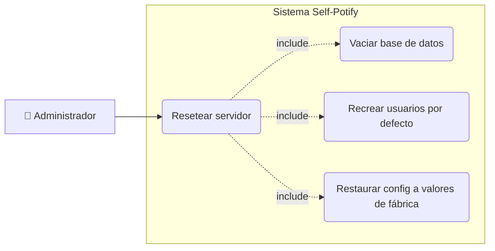

### UC8 — Gestionar branding y logo

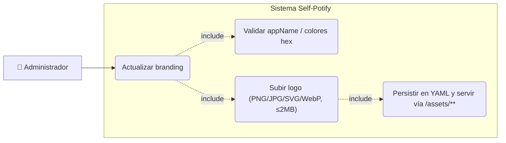

### UC9 — Ver el feed de recomendaciones del home

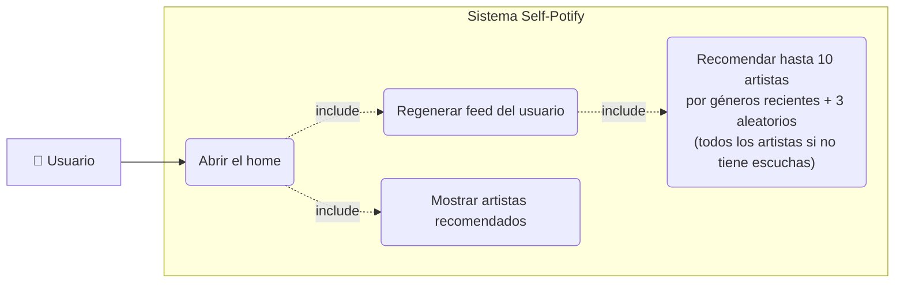

### UC10 — Ver la página de un artista

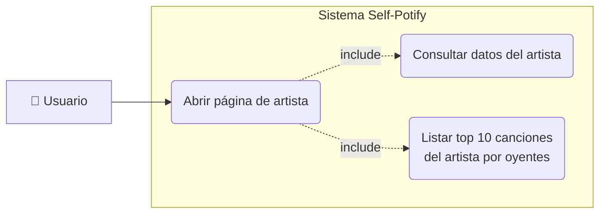

### UC11 — Ver los descubrimientos diarios

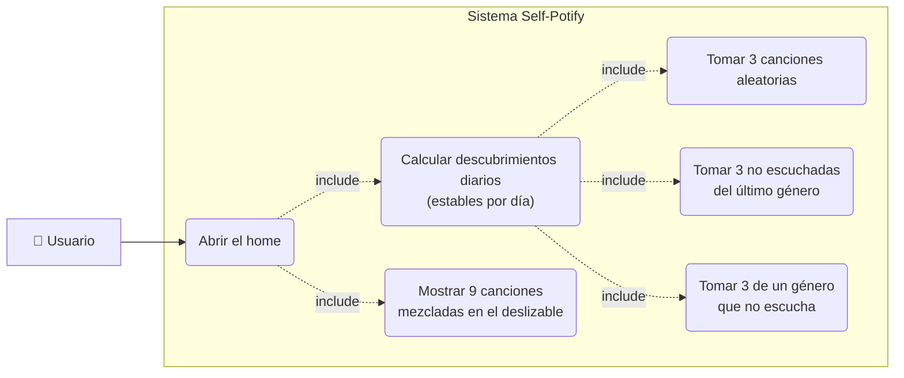

## Diagrama de arquitectura


