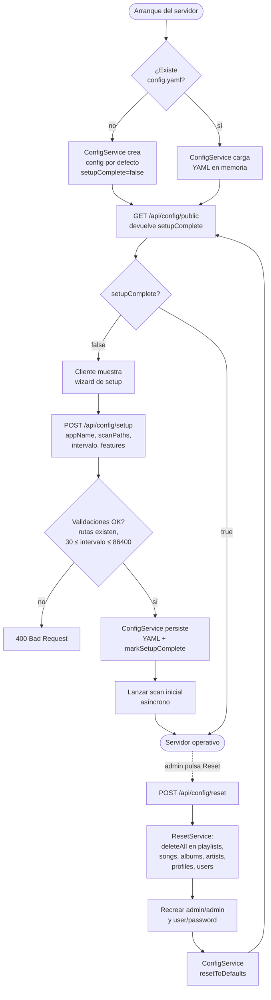
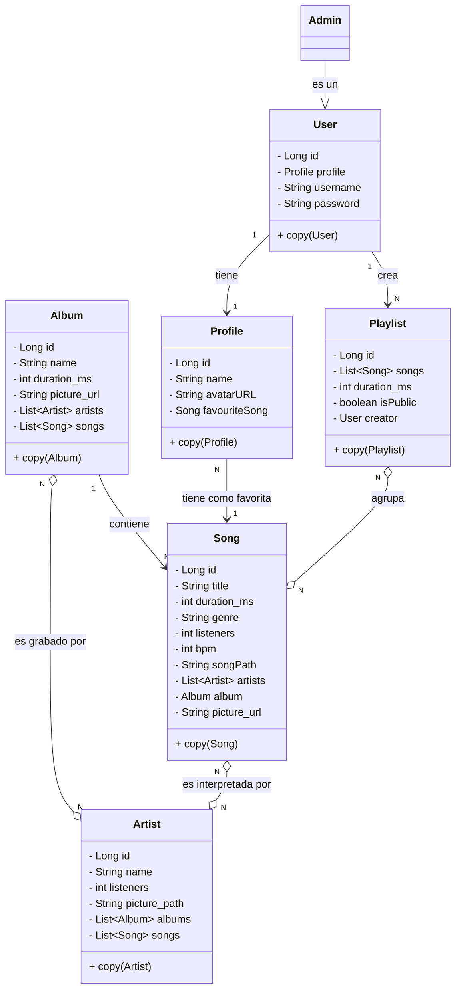
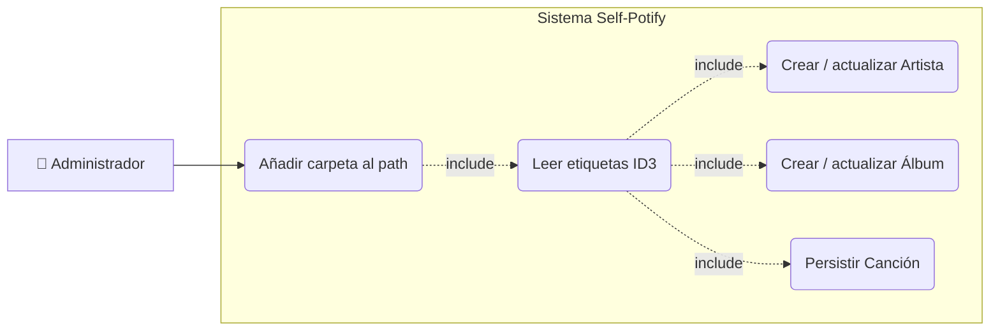
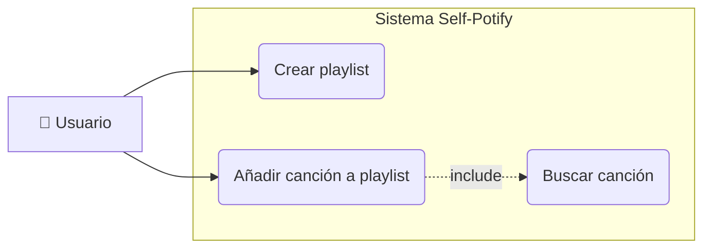
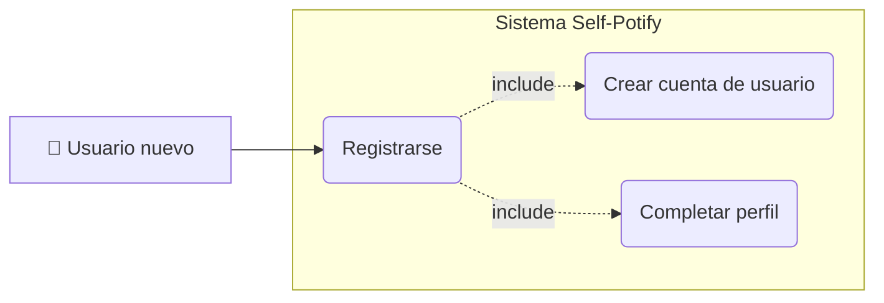
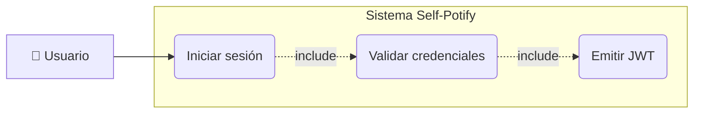
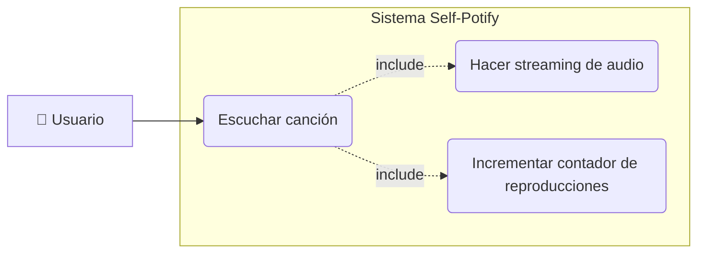
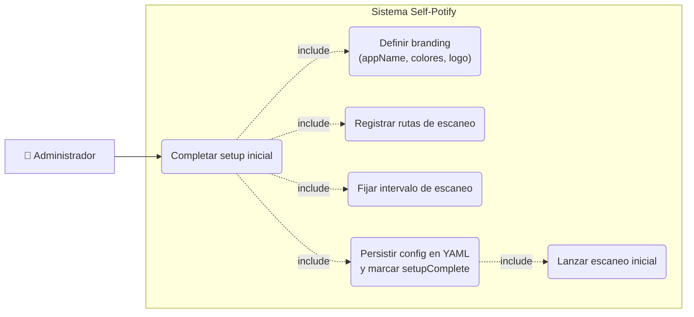
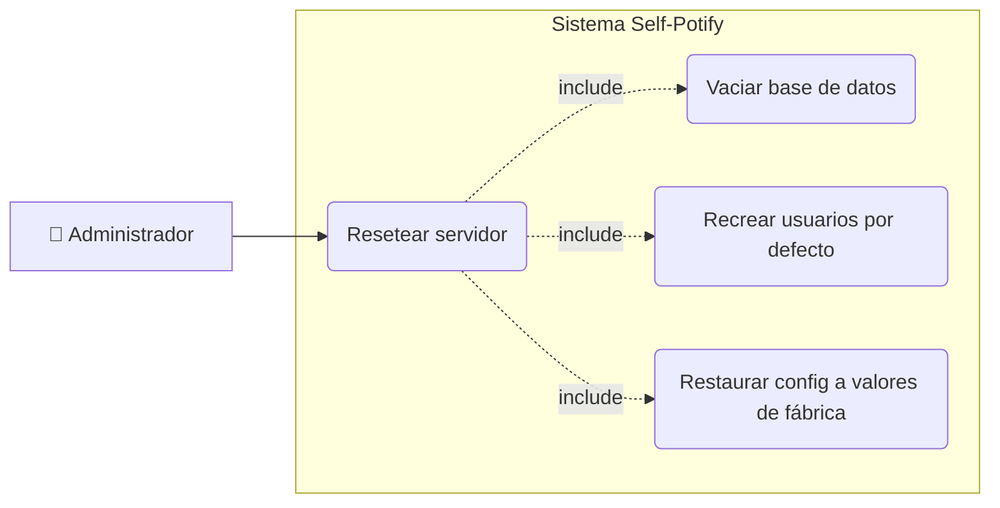
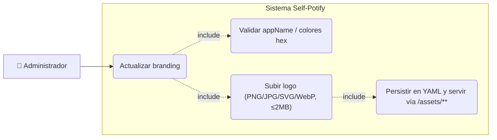

# Self-Potify

## Objetivos

Mi idea para mi proyecto de fin de grado es crear un "clon" alternativo de código abierto de Spotify. Funcionará con tecnologías de streaming, permitiendo escuchar la música con baja latencia sin tener que esperar a que descargue ningún archivo igual que en el original, y tendrá sistemas de playlist creadas automáticamente como "Recomendaciones Diarias" o "Selección del artista".

El proyecto incluiría:

- **Servidor Self-Potify** — Contiene toda la librería musical organizada en carpetas, además de la BBDD que almacenará tanto los usuarios como sus likes / playlists.
- **Cliente web** — Para escuchar la música del servidor en streaming desde un ordenador. Esto será a través de un servidor web en el que puedes acceder solamente con tu login de usuario.
- **Cliente móvil / televisión** — Aplicación para Android con las mismas funciones que la web pero mayor rendimiento. Al entrar por primera vez, se tendrá que configurar para poner los datos de conexión al servidor (IP / puerto) y el login, que permanecerá activo. El traspaso de datos será mediante una API con JWT, que mantendrá la sesión activa por varios meses.

## Justificación de la necesidad

Este software permitiría a los usuarios poder disfrutar de escuchar música libremente, sin anuncios y gestionándolo todo desde su servidor, necesidad cada vez más creciente debido al abuso de estas empresas de streaming hacia sus consumidores cada vez dando servicios de menos calidad solo para intentar recaudar más dinero.

## Tecnologías a emplear

| Tecnología             | Uso |
|------------------------|---|
| **Spring Boot (REST)** | API, lógica back-end y servidor web |
| **FFMPEG**             | Procesado de audio en fragmentos para streaming |
| **React + Next JS**    | Front-end del cliente web y recepción de streaming |
| **MongoDB**            | Base de datos principal por su flexibilidad con datos dinámicos (playlists, likes…) |
| **Jetpack Compose**    | Aplicación móvil y televisión (Android) |
| **Media3**             | Recepción de streaming en la app móvil |

---

## Decisiones de diseño

### Arquitectura
He decidido crear esta aplicación basada en **microservicios** en vez de usar una arquitectura monolítica. Esto porque pienso que 
así puedo desarrollar una aplicación más escalable, cuyo core sea el servidor API de springboot, del que consumen diferentes clientes
como el web o mobile, dándome la posibilidad a futuro de crear más para otras plataformas.

### Despliegue

**Este proyecto está pensado para usuarios técnicos** que quieren reemplazar Spotify por una tecnología similar, accesible y sobre todo más económica y libre,
por lo que será su responsabilidad montar y mantener el servidor, así como la mía facilitar lo máximo posible la instalación, configuración y set-up de la 
estructura de red para permitir el acceso desde internet. Por esto, al arrancar el servidor por primera vez, tendrá un pequeño wizard web que permite cambiar estos parámetros (IP de acceso, directorios de música...).

El estado del wizard se persiste en un fichero YAML externo gestionado por `ConfigService`, con el flag `features.setupComplete` como interruptor entre "primer arranque" y "servidor ya operativo". El endpoint `POST /api/config/reset` permite al admin devolver el servidor a su estado de fábrica (vaciado de BBDD, usuarios por defecto `admin/admin` y `user/password`, y config en blanco), volviendo a forzar el wizard en el siguiente arranque.

#### Flujo de setup inicial y reset

### Funcionamiento del streaming

Para hacer que los clientes puedan recibir la música en pedazos de bytes con la librería media3, he implementado la ruta de la API
``/api/listen/{id}``, endpoint que soporta http range, permitiendo reproducir sin descargar el archivo completo.

### Gestión de la biblioteca musical

La biblioteca musical será gestionada por los admins, que tendrán la posibilidad de añadir carpetas que el backend escaneará periódicamente en busca de cambios o nuevas canciones, para poder administrar la música de forma sencilla con el explorer.

El escaneo lo dispara `SchedulingConfig` mediante un `PeriodicTrigger` que **relee el intervalo configurado en cada tick**, de forma que los cambios en `scan.intervalSeconds` realizados vía `PUT /api/config` se aplican en caliente sin reiniciar el servidor. La concurrencia se protege con un `ReentrantLock` en `ScanService`: si llega un tick (o un `POST /api/config/scan/run` manual) mientras hay otro escaneo activo, se descarta. Al añadir una ruta nueva vía `POST /api/config/scan-paths` se lanza además un escaneo inicial asíncrono solo de esa carpeta para no esperar al siguiente tick.

#### Flujo del escaneo periódico

---

## Gestión de recursos

Al ser un aplicativo pensado para un uso personal, normalmente con pocos usuarios, el servidor no requiere de grandes prestaciones hardware. 
Sí serán necesarios unos mínimos para poder emitir correctamente el streaming, como una buena conexión de red (CAT5 mínimo) y 2 GB de RAM. 

La única limitación de recursos en el uso de la aplicación, al estar tratando con archivos multimedia, es el espacio en disco del server para almacenar la música. No hay un mínimo, pero se recomienda tener abundante (200 GB) para poder llegar a disponer 
de un catálogo considerable de música, sobre todo si el usuario se preocupa por la calidad de la misma. 

## Diagrama de clases

---

## Diagramas de casos de uso

### UC1 — Añadir carpeta al path

### UC2 — Crear playlist y añadir canciones

### UC3 — Registro y creación de perfil

### UC4 — Login

### UC5 — Escuchar una canción

### UC6 — Setup inicial del servidor

### UC7 — Reset del servidor

### UC8 — Gestionar branding y logo

## Diagrama de arquitectura

