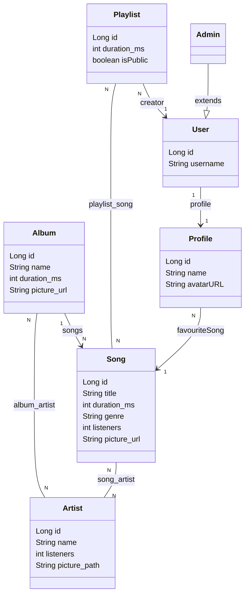

# Self-Potify

## Objetivos

Mi idea para mi proyecto de fin de grado es crear un "clon" alternativo de código abierto de Spotify. Funcionará con tecnologías de streaming, permitiendo escuchar la música con baja latencia sin tener que esperar a que descargue ningún archivo igual que en el original, y tendrá sistemas de playlist creadas automáticamente como "Recomendaciones Diarias" o "Selección del artista".

El proyecto incluiría:

- **Servidor Self-Potify** — Contiene toda la librería musical organizada en carpetas, además de la BBDD que almacenará tanto los usuarios como sus likes / playlists.
- **Cliente web** — Para escuchar la música del servidor en streaming desde un ordenador. Esto será a través de un servidor web en el que puedes acceder solamente con tu login de usuario.
- **Cliente móvil / televisión** — Aplicación para Android con las mismas funciones que la web pero mayor rendimiento. Al entrar por primera vez, se tendrá que configurar para poner los datos de conexión al servidor (IP / puerto) y el login, que permanecerá activo. El traspaso de datos será mediante una API con JWT, que mantendrá la sesión activa por varios meses.

## Justificación de la necesidad

Este software permitiría a los usuarios poder disfrutar de escuchar música libremente, sin anuncios y gestionándolo todo desde su servidor, necesidad cada vez más creciente debido al abuso de estas empresas de streaming hacia sus consumidores cada vez dando servicios de menos calidad solo para intentar recaudar más dinero.

## Tecnologías a emplear

| Tecnología | Uso |
|---|---|
| **Spring Boot (REST)** | API, lógica back-end y servidor web |
| **FFMPEG** | Procesado de audio en fragmentos para streaming |
| **Thymeleaf + Tailwind + hls.js** | Front-end del cliente web y recepción de streaming |
| **MongoDB** | Base de datos principal por su flexibilidad con datos dinámicos (playlists, likes…) |
| **Jetpack Compose** | Aplicación móvil y televisión (Android) |
| **Media3** | Recepción de streaming en la app móvil |

---

## Diagrama de clases

